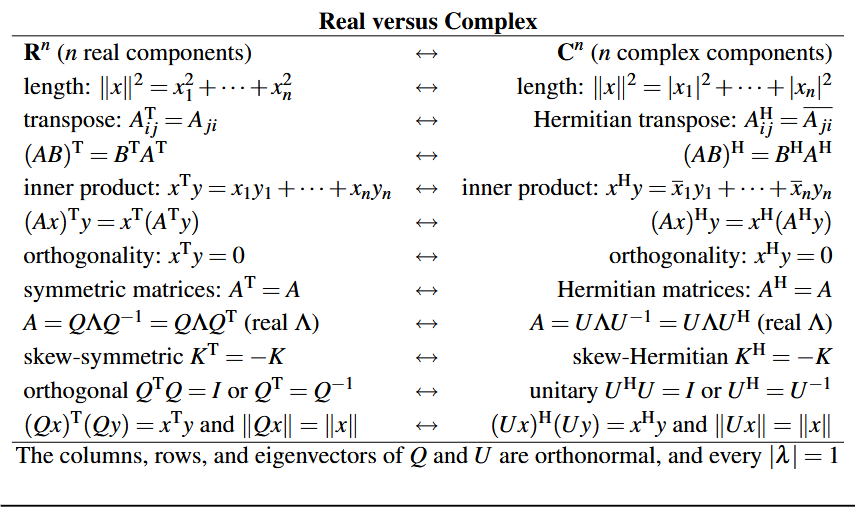
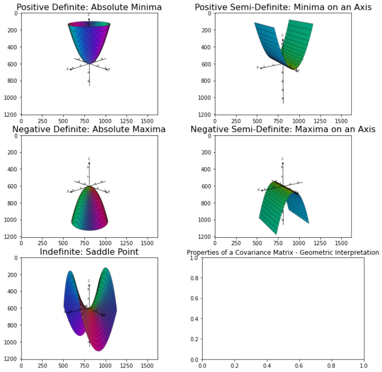

# MLF formula

## **Regression :**

- $f(x) = W^Tx+b = \sum_{i=1}^d w_ix_i+b$
- Loss =    $\frac{1}{n} \sum_{i=1} ^ n (f(x_i)-y_i)$

## Classification :

- $f(x) = \sin(W^Tx+b)$
- $loss = \frac{1}{n} \sum_{i=1}^n 1(f(x_i) \ne y_i)$

## Dimensionality reduction :

- $Encoder \qquad f: \mathbb R^d \to \mathbb R^{d'}$
- $Decoding \qquad f:\mathbb R^{d'} \to \mathbb R^d$
- $Goal \qquad g(f(x_i)) \approx x_i$
- $loss \qquad \frac{1}{n} \sum _{i=1}^n || g(f(x_i)) - x_i||^2$

## Density Estimations :

- Probability mapping $P : \mathbb R^d \to \mathbb R_+$ (sum of all $\mathbb R_+$ is 1)
- Goal : $P(x)$ is large if $x\in Data$ and low otherwise
- loss : $\frac{1}{n} \sum _{i=1} ^n -log (P(x^i)$    (recognition error)
- $f$ is better if $\boxed{Loss[f] \lt Loss[g]}$

# Calculous

### Continuity :

$\lim_{x \to a^-}f(x) = f(a) =  \lim_{x \to a^+}f(x)$

### Differentiability:

$\lim_{x \to a^-}\frac{f(x)-f(a))}{x-a} = f'(a) =  \lim_{x \to a^+}\frac{f(x)-f(a))}{x-a}$

## Linear approximation:

$*\boxed{f(x)≈f(a)+f'(a)(x-a)}*$

Here:
$*f(a)*$ is the function value at $*a*$,
$*f'(a)*$ is the derivative of $*f*$ at $*a*$, representing the slope of the tangent line,
$*(x-a)*$ is the difference between the point $x$ where we want to approximate $f$and the point $a$ where we know $f$.

### $n^{th}$ order approximation:

$\boxed{f(x)=f(a)+\frac{f'(a)}{1!}(x-a)+\frac{f''(a)}{2!}(x-a)^2+\frac{f'''(a)}{3!}(x-a)^3 + \cdots }$

### Approximation for multivariate function:

$f(x,y)$ is known, we want to approximate $f(a,b)$

1. Linear:  $\boxed{f(x,y)=f(a,b)+\frac{\partial f}{\partial x}\bigg|_{(a,b)}(x-a)+\frac{\partial f}{\partial y}\bigg|_{(a,b)}(y-b)}$
2. Higher: $f(v)=f(x)+\nabla f(x)^T(v-x)+\frac{1}{2}(x-v)^T \nabla^2f(x)(v-x)$
3. For a function of two variables, f(x,y)*f*(*x*,*y*), the quadratic approximation around (a,b)(*a*,*b*) is:
$\boxed{f(x,y)≈f(a,b)+f_x(a,b)(x−a)+f_y(a,b)(y−b)+ \\ \frac{1}{2}f_{xx}(a,b)(x−a)^2+f_{xy}(a,b)(x−a)(y−b)+\frac{1}{2}f_{yy}(a,b)(y−b)^2}$
4. The Taylor series expansion for a multivariable function $f(\vec{x})=f(x1,x2,…,xn)$ around a point $\vec{a}=(a1,a2,…,an)$ is given by:
$\boxed{f(\vec{x}) = f(\vec{a}) + \nabla f(\vec{a}) \cdot (\vec{x} - \vec{a}) + \frac{1}{2}(\vec{x} - \vec{a})^T H(\vec{a})(\vec{x} - \vec{a}) + \dots}$

    - $f(\vec{a})$ is the function value at $\vec{a}$,
    - $∇f(\vec{a})$ is the gradient of $f$ at $\vec{a}$, a vector of partial derivatives,
    - $H(\vec{a})$ is the Hessian matrix of $f$at $\vec{a}$, containing second partial derivatives.

## Gradient:

$\nabla f(x,y) =[\cfrac{\partial f(x,y)}{\partial x}, \cfrac{\partial f(x,y)}{\partial y}]$

### Directional derivative:

$D_{\vec{u}} f(x,y) = \nabla f.u = u_1 \frac{\partial f}{\partial x} + u_2 \frac{\partial f}{\partial y}$

### Cauchy-schwarz Inequality:

$-\parallel a \parallel . \parallel b \parallel \ \le  \ a^Tb \ \le \ \parallel a \parallel . \parallel b \parallel$

Matrix:

### Projection:

- $proj_v^a = \cfrac{\vec{a} . \vec{v}}{||{\vec{v}||}^2} \vec{v}$
- Projection Matrix : P = $\cfrac{a.a^T}{a^Ta}$
- Projection of b onto a :  $p=P.b=\cfrac{a.a^T}{a^Ta} . b$
- Projection of a along b : $q = \cfrac{a.b}{||b||} \times b$

### Orthogonality:

$a.b=0$  [ dot product = 0 ]

### Least Square Solution (LSS):

$Ax = b$

1 -  Find $A^TA$  and $A^Tb$ 
2 - Find augmented matrix for $A^TAx = A^Tb$
3 - Row Reduction
4 - Solution $\^{a}$ is LSS

## Linear Regression :

- Goal : minimize $L(W)= \frac{1}{2} \sum_{i=1}^n (w^Tx_i-y_i)^2$
- $x_1 = \begin {bmatrix} fe_1 \\ \vdots \\ fe_n \end{bmatrix}$ , $x_1$  is the first data point
- feature matrix $A = \begin {bmatrix} x^T_1 \\ \vdots \\ x^T_n \end{bmatrix}$ , $y = \begin {bmatrix} y_1 \\ \vdots \\ y_n \end{bmatrix}$ and $W = \begin {bmatrix} w_1 \\ \vdots \\ w_n \end{bmatrix}$ ,, $w_i$  are parameters (weights for eatch feature)
- $L(w) = \frac{1}{2}(Aw-y)(Aw-y)^T$
- $\text{Least Square Solution} = (XX^T)w = X y \\or\\ w=(XX^T)^{-1}X y$  if every vector is a column in X

### Polynomial Regrassion:

$\hat y(x) = \theta_0 + \theta_1x_1 + \theta_2 x^2 + \dots + \theta_n x_n$ 

$\hat y(x) = \theta^T \phi(x)$  ,  $\phi(x) = (1,x,x^2, \dots,x^n)$

$A = \begin {bmatrix} \phi(n_1)^T \\ \vdots \\ \phi(n_n)^T \end{bmatrix}$, $y = \begin {bmatrix} y_1 \\ \vdots \\ y_n \end{bmatrix}$

$LSS  \to \boxed {(A^TA) \theta = A^T y}$

## Maximum likelihood:

$L(\theta) = \cfrac{\pi}{i} \cfrac{\sqrt\beta}{\sqrt{2 \pi}} \ \ \ \ { exp(\frac{-\beta}{2}(y_i-\theta^T x_i)^2)}$

### Regularised version (Ridge Regression):

$\bar{L}(\theta) = \frac{1}{2}\sum_{i=1}^{n}(w^Tx_i - y_i)^2 + \lambda \parallel w \parallel ^2$ 

## Multiplicity

- **Geometric Multiplicity (GM)** : number of independent eigencectors of a $\lambda$
- **Algebraic Multiplicity (AM)** : number of repetations of $\lambda$ among the eigenvalues
- $GM \le AM$
- $GM$ = dimension of null space of $A-\lambda I$

## Eigen values and Eigen vector:

$\det(A - \lambda I) = 0$

Characteristic equations:

Properties of Eigenvalues:

Properties of Eigenvectors:

Diagonalisation:

Orthogonally Diagonalizable matrices:

## Real Symmetric matrices

- properties
    - n real eigenvalues
    - n orthogonal eigenvectors
    - always diagonalisable $S=Q \Lambda Q^{-1} = Q \Lambda Q^{T}$
    (even when there are repeating eigenvalues)

## Complex matrix:

- Conjugate:      $\overline{(a+ib)} = (a-ib)$
- Inner product:       $\overline{x}^T.y$
- Length:     $||x||^2 = \overline{x}^T.x$
- $(a+ib)(a-ib)= a^2+b^2 = r^2$

### Conjugate Transpose:

- $A^* = \overline{A}^T =\overline{A^T}$
- $(A^*)^* = A$
- $(AB)^* = B^* A^*$

### Hermition:

- $\begin{bmatrix} \mathbb R & \mathbb C  \\ \overline{ \mathbb C} & \mathbb R \end{bmatrix}$ $\begin{bmatrix} \mathbb R & \mathbb C_1 & \mathbb C_2  \\ \overline{ \mathbb C}_1 & \mathbb R & \mathbb C_3 
\\ \overline{ \mathbb C}_2 & \overline{ \mathbb C}_3 & \mathbb R  
\end{bmatrix}$
- $\overline{A}^T= A$
- **Properties :**
    - Hermition in $\mathbb{C}$  $\equiv$ Symmetric in $\mathbb R$
    - **determinant of a Hermitian matrix** is always a real number.
    - for any matrix product with it’s conjugate is Hermition matrix
    - $A$ is Hermitian and $k$ is a real scalar, then $kA$ is also a Hermitian matrix
    $(kA)^H=kA^H=kA$
    - square matrix
    - diagonal entrys are real
    - $\lambda_i \in \mathbb R$
    - eigen vector corrosponding to distinct e.value are orthogonal to eachother
    - if $\lambda_i$ are distinct then a is **orthogonaly diagonalizable** (coz then only $P^{-1}$ possible)
    - always diagonalizable
    - $C^H=(A+B)^H=A^H+B^H$ where $(A=A^H,B=B^H,C=C^H)$
    - The **multiplication of two Hermitian matrices** is not necessarily Hermitian.
    if $AB = BA$ then the product is Hermitian matrix
    

Skew-Hermition:  

### Unitary:

- $\overline{A}^T .  A = I$
- **Properties:**
    - Square matrix
    - $det(A) = 1$
    - Always invertable
    - Orthogonal matrix
    - Orthonormal columns
    - if $A$ is unitery then $\overline{A}^T$ is also unitery
    - $||Ux||=||x||$ , if we multiply any vector with unitery matrix, the length of the vector will not change
    - $|\lambda|=1$
    - Eigen vector corrosponding distinct E.value are orthogonal
    - $\lambda_i \ne 0$
    - Always full rank
    - Addition is **not always** Unitary
    - Multiplication is **always** Unitary

## Diagonalization:

- Diagonalizable if
    - n linearly independent eigen vectors
    - n distinct eigen values
    - Sum of geometric multiplicity is n
    - For each /lambda geo.mul = alg.mul

## Schur's Theorem:

- **Theorem** : if $A$  is asquare matrix with real eigenvalues, then there is an orthogonal matrix $Q$ and and upper triangular matrix $T$ such that. $A=QTQ^T$
- if $T$ is upper triangular matrix then $T^T$ is lower triangular matrix

## Spectral Theorem:

## Quardratic form:

- $f(x) = ax^2+bxy+cy^2$
$f(x,y)=\begin{bmatrix} x & y  \end{bmatrix} \begin{bmatrix} a & b/2 \\ b/2 & c \end{bmatrix} \begin{bmatrix} x \\ y \end{bmatrix}$

- $f = ax^2 + by^2+cz^2 + dxy+eyz+fzx$

$f(x,y,z)=\begin{bmatrix} x & y &z \end{bmatrix} \begin{bmatrix} a & d/2 & f/2 \\ d/2 & b &e/2 \\ f/2 & e/2 & c \end{bmatrix} \begin{bmatrix} x \\ y \\z\end{bmatrix}$

## Partial Derivatives:

## Maxima & Minima:

## Definiteness:

- $f=a x^2 + 2b \, x y + c \, y^2 \\
f = v^TAv = [x,y] \begin{bmatrix}a &b \\ b& c  \end{bmatrix} { x \brack y} = \sum_{i=1}^n \sum_{j=1}^n a_{ij}x_i x_j$

| $+ve$ | $f \gt 0$ | $a \gt 0, \quad ac-b^2 \gt 0$ | $\lambda_i \gt 0$ |
| --- | --- | --- | --- |
| $-ve$ | $f \lt 0$ | $a \lt 0, \quad ac-b^2 \lt 0$ | $\lambda_i \lt 0$ |
| $+ve -semi$ | $f \ge 0$ | $a \gt 0, \quad ac-b^2 = 0$ | $\lambda_i \ge 0$ |
| $-ve -semi$ | $f \le 0$ | $a \lt 0, \quad ac-b^2 = 0$ | $\lambda_i \le 0$ |
| $indefinite$ | $f\gt0 , f\lt 0$ | $ac-b^2 \lt 0$ | $\lambda_i \gt0 , \lambda_i \lt0$ |
- **Property**
    - $\lambda_i \gt 0 \to$  positive definite matrix
    - $\begin{bmatrix}a &b \\ b& c  \end{bmatrix} \to \begin{bmatrix}a \ge 0 &b \\ 0& \frac{ac-b^2}{a} \ge 0  \end{bmatrix} \to$  positive sevidefinite
    - $+ve \to$ every column is independent
    - All eigen values are greater then zero
    - Every positive definite matrix is invertible. (rull rank)
    - If matrix $A$ is positive definite then $A^{-1}$ may also be positive definite
    - If matrix $A$ is positive definite then $A^2,A^3,A^4$ is also positive definite
    - If $A$ is positive definite and $A+B$ is positive devinite then $B$ is also positive definite
    - $\mathbf v^T A \, \mathbf v = \lambda \mathbf v^T \mathbf v = \lambda || \mathbf v||^2$

## Singular Value Decomposition (SVD)

Given A

1. find $A^TA$
2. find eigenvalues of $A^TA$ and sort then in descending order of their absolute values. 
3. find singular values by taking squart root of eigenvalues : $\sigma_i =\sqrt{\lambda_i}$ 
4. construct $S$ by placing $\sigma_i$’s in descending order along this diagonal. $S=\begin{bmatrix}\sigma_i &o \\ 0& \searrow \end{bmatrix}$
5. calculate $S^{-1}$
6. using eigenvalues compute eigenvectors of $A^TA$ and place these along columns of $V=\begin{bmatrix}| & | \\ x_1 & x_2 \\ | &|  \end{bmatrix}$ and find $V^T$ .. 
7. fing $U = AVS^{-1}$
8. result : $A = USV^T$

## Principal Component Analysis(PCA):

- $D = [ x _1 , \cdots ,x_n] , \ wtere, \  x_i = \begin{bmatrix} fe_{i1} \\ \vdots \\ fe_{im} \end{bmatrix}$
- **Steps ————————————**
    1. Find Find the mean vector $\bar{X}$ of the dataset
    $\bar X = \sum \frac{1}{n} x_i = \cfrac{x_1 + x_2+ \dots + x_n}{n}$  ( mean vector)
    2. Form the data matrix : 
    $X  = \begin{bmatrix} | &|&| \\x _1 - \bar x_1 & \cdots &x_n - \bar x_i \\ | &|&|\end{bmatrix}$
      (centering)
    3. $C = \frac{1}{n} XX^T=\frac{1}{n} \sum (x_i- \bar x)(x_i- \bar x)^T$   (covarience matrix) (it is symmetric $m \times m$)
    4. Find eigenvalues and eigenvectors of C and arrange them in the descending order   $\lambda_1 \ge \lambda_2 \ge \dots \ge \lambda_n$ 
    and the associated $unit$ eigenvectors  $u_1 ,u_2, \dots , u_n$ 
    5. Find transformed data points
    $\tilde{x_i} = \sum (x_i^T u_j) u_j$ 
    the eigenvector $u_1$ associated with the greatest eigenvalue $λ_1$ is referred to as the first principal component, the vector $u_2$ associated with the eigenvalue $λ_2$ is called the second principal component and so on.
    6. Properties:
        1. Principal components are orthogonal to each other
- Reconstruction Error : $J = \frac{1}{n} \sum _{i=1}^n ||x_i - \tilde x_i||^2$
- Projected Variance : $\lambda_1 + \lambda_2 + \dots + \lambda_k$

# Convexity:

## Convex set:

- $S \subseteq \mathbb R^d$ is convex if  $\forall x_1,x_2 \in S$ then 
 $\lambda x_1 +(1- \lambda)x_2 \in S, \quad \forall \lambda \in [0,1]$
- **Examples of convex sets include:**
    - the empty set
    - a set consisting of a single point
    - a line or a line segment
    - a subspace
    - a hyperplane
    - a linear variety (a translation of a subspace)
    - a half-space
    - 
- **Property of convex set:**
    - If S is a convex set and $\beta$ is any real number, then set
    $\beta S = \{x \mid x = \beta v, \ v\in S\}$ is also convex
    - If $S_1$  and $S_2$ are convex setx, then the set
    $S_1+S_2 = \{ x \mid x =v_1 + v_2 , \ v_1\in S_1,v_2 \in S_2\}$ is also **convex**
    - If $S_1, S_2 \subseteq \mathbb R$, then $S_{12}=S_1 \cap S_2 = \{ x : x \in S_1, x\in S_2 \}$
    **”intersection of convex set is convex”**
- **Convex Hull:**
    - $S=\{ x_1,x_2, \dots ,x_n\} \subseteq \mathbb R^d \\Z = \lambda_1 x_1 + \lambda_2 x_2 + \dots +\lambda_n x_n$
    - $Z$ is a convex combination of $S$ if there exist $\lambda_1, \lambda_2, \dots, \lambda_n$ 
    s.t. $\lambda_i \ge 0, \quad \sum _i \lambda = 1$
    - Convex Hull is a convex set.

## Convex functions:

- **Definations:**
    - A function $f$ is convex if $epi(f)$ is convexset.
    $epi(f) = \{ {x\brack z} \in \mathbb R^d : Z \ge f(x) \}$
    - $f$ is convex if $f(\lambda x_1 + (1 - \lambda)x_2 \le \lambda f(x_1) + (1- \lambda)f(x_2)$ holds $\forall \lambda \in [0,1]$
    - $f:\mathbb R^d \to \mathbb R$ is convex iff for a point $y$ : $f(y) \ge f(x) + (y-x)^T \nabla f(x)$
    - $f:\mathbb R^d \to \mathbb R$ ,  where $H$ is the Hessian matrix of $f$ :  $\begin{bmatrix}f_{xx}&f_{xy}&f_{xz} \\ f_{yz}&f_{yy}&f_{yz} \\f_{zx}&f_{zy}&f_{zz} \end{bmatrix}$
        - $det(H) \ge 0$
        - ( $\lambda_i$ of $H$) $\ge 0$    (Positive definite or Positive semi-definite)
    - For convex function if $x^*$ is local minima and Z is global minima then 
    $f(Z) = f(x^*) \le f(x), \quad \forall x \in [x^* - \delta , x^* + \delta], \delta \gt 0$
- **Properties of Convex Functions**
    - If $f$ is a convex function, then all local minima of are also global minima.
    - The set of all global minima of a convex function is a convex set.
    - If $f : \mathbb R^d \to \mathbb R$ be a differentiable, convex function, then for a point $x^* \in \mathbb R^d$ to be a global minimum of $f$, the necessary and sufficient condition is
    $\nabla f(x^*)=0$
    - If $f, g : \mathbb{R}^d \to\mathbb{R}$ be convex functions, then their sum $f(x)+g(x)$ is also a convex function.
    - If $f:\mathbb{R} \to\mathbb{R}$ be a **convex and non-decreasing** function, and $g:\mathbb{R}^d \to \mathbb{R}$  be a **convex function**, then their composition $f(g(x))$ is a convex function.
    - If $f:\mathbb{R} \to\mathbb{R}$ be a convex and non-increasing function, and $g:\mathbb{R}^d \to \mathbb{R}$ be a concave function, then their composition $f(g(x))$ is a convex function.
    - The composition of two convex functions need not be convex.
    - A function $f$  is concave if and only if $-f$ is convex.
    

# Optimization

## UnConstrained Optimization:

## Gradient Descent:

- $\boxed {x_{t+1} = x_t + \eta_t \Big(-f'(x_t)\Big)}$
$f(x)$ = objective function
$\eta_t = \frac{1}{t+1}$ = step size 
$x_t$ = initial position
- Higher order Gradient Descent :   $\boxed {x_{t+1} = x_t + \eta_t \Big(-\nabla f(x_t)\Big)}$

## Newton's method:

$\boxed { x_{t+1} = x_t-\frac{f'(x_t)}{f''(x_t)}}$

## Taylor's series:

- $ f(x+ \eta d) = \boxed{f(x)+ \frac{\eta d}{1!} f'(x)} + \overbrace{\frac{\eta ^2 d^2}{2!} f''(x)+\frac{\eta^3 d^3}{3!} f'''(x)+ \dots}^{\text{As }\eta\text{ is small, these terms are negligible}}
$
    - $f(x),f'(x),f''(x)$  evaluated at $x$, it means if we know every thing about the function at $x$ then we can know every thing at any point.
- $\boxed{ f(x+ \eta d) \approx f(x)+ \eta d \ f'(x) }$  ( for small (step) $\eta$) 
$\implies df'(x) \lt 0$   ,,$\quad [d = -f'(x)]$ , (d is descent direction)

### Taylor’s series for higher dimensions:

- $\boxed{ f(x+ \eta d) \approx f(x)+ \eta d^T \nabla f(x) }$
$d^T \nabla f(x) \lt 0$
$d = - \nabla f(x)$  ( steepest ascent)
- Location Vector :   $( t+1)$ step along the direction d
$x_{t+1} = x_t + \eta d^T \nabla f(x_t) , \qquad d = - \nabla f(x_t)$
- just another way
$f(a,b,c) = f(x,y,z) + \nabla f(x,y,z)(x-a)(y-b)(z-c)$ 
in this case    $\eta d = increment$  , (x,y,z)-(a,b,c)

## Constrained Optimization:

- **Inequality Constraint** 
 $\begin{array}{lrl} & {\displaystyle \min_{x}}& f(x) \\        \text{subject to} &&  g(x) \le 0     \end{array}$
    - no descent direction should be a feasible direction
    - $\boxed{\nabla f(x^*) = -\lambda \nabla g(x^*)}$
    - $\lambda \to$ +ve scaler
    - Descent direction : $d^T \nabla f(x) \lt 0$
    - Feasible direction :  $g(x) \le 0$
- **Equality Constraint
$\begin{array}{lrl} & {\displaystyle \min_{x}}& f(x) \\        \text{subject to} &&  g(x) = 0     \end{array}$**
    - $\boxed{\nabla f(x^*) = \lambda \nabla g(x^*)}$
    - $\lambda \to$ (Lagrange multiplier) any scaler

## Method of Lagrange Multipliers:

- Minimize : $f(x)$ under $g(x)=0$
- necessary : at $x^*$, $d^T \nabla g(x^*) = 0$
- optimal : $\nabla f(x^*) = - \lambda \nabla g(x^*)$

- Unconstrained optimization
    - if $f$ is convex, the global minimum can be obtained by solting $\nabla f(x) =0$
- Constrained optimization
    - the problem:
    $\begin{array}{lrl}& {\displaystyle \min_{x}} & f(x) \\        \text{subject to} &&  g(x) \le 0     \end{array}$
    
    where $f, g :\mathbb{R}^d \to \mathbb{R}$
    - Define the Lagrangian:
    $\mathcal{L}(x, \lambda) = f(x) + \lambda g(x)$
    - fix $x \in \mathbb R^n \\ \boxed{ {\displaystyle \max_{\lambda \ge 0}} \  \mathcal{L}(x,\lambda) = {\displaystyle \max_{\lambda \ge 0}} \ f(x) + \lambda g(x) = \begin {cases} f(x) & g(x) \le 0 \\ +\infty & g(x) \gt 0 \end {cases}}$
    - if $x$  is in the feasible region $\Big(g(x) \le 0 \Big)$, so the graph of $\mathcal{L} (x, \lambda)$ versus $\lambda$ is downward slanting line with maximum value $f(x)$ for $\lambda \ge 0$.
    - if  $x$ is not a feasible point, then $g(x) \gt 0$, so the graphy of $\mathcal{L} (x, \lambda)$ versus $\lambda$ is an upward slanting line with maximum value $\to +\infty$ for $\lambda \ge 0$
    - as a result, in the feasible region:
    $f(x) ={\displaystyle \max_{\lambda \ge 0}} \  \mathcal{L}(x,\lambda)$
    - hence, the original problem is equivalent to finding the minimum value of for $ \lambda \ge 0$ ,  the Lagrangian formulation is:
$ \boxed {\begin{alignedat}{2}
&\min_{x} \quad && f(x) \\
&\text{subject to} \quad && g(x) \le 0 
\end{alignedat}
\quad \equiv \quad \min_x \left( \max_{\lambda \ge 0 } \mathcal{L}(x, \lambda) \right)}  $ is known as the primal form of the optimization problem.
    - this $\min \max$ problem is usually hard to solve
    - the corresponding dual form of the optimization problem is 
    $\max_{\lambda \ge 0} \left( \min_x \mathcal{L}(x, \lambda) \right)$

    - thus  
    $\begin{aligned} 
\boxed{\min_x \left( \max_{\lambda \ge 0} \mathcal{L}(x, \lambda) \right)} &\;\ge\; \boxed{\max_{\lambda \ge 0} \left( \min_x \mathcal{L}(x, \lambda) \right)} \\ 
\text{Primal } &\qquad\qquad\quad \text{Dual} 
\end{aligned}$

    
        - **Primal optimum** $x^*$  is the point at which the primal form attains the minimum $f(x^*)$
        - **Dual optimum** $\lambda^*$ is the value at which the dual form attains its maximum $l(\lambda^*)$
    - in general , the value at the primal optimum may not be equall to the value at the dual optimum.
    - **Weak duality** says that the value at the dual optimum is less than or equal to the value at the primal optimum: $l(\lambda^*)\le f(x^*)$
    - **Strong duality** if the objective function and the inequality constraints are convex functions, the value at the 
    primal optimum = dual optimum
    - Stationarity condition :$\nabla f(x^*) + \lambda^* \nabla g(x^*) =
    0$
    - Complimentary slackness condition: $\lambda^* \  g(x^*) = 0$
    - Primal feasibility conditiion: $g(x^*) \le 0$
    - Dual feasibility condition: $\lambda^* \ge 0$

# Linear Programming (LPP):

## Karus-Kugn_Tucker Conditions(KKT)

$\begin{matrix}    & {\displaystyle \min_x}\ f(x) & \\[2ex]    \text{subject to } & g_i(x) \le 0, & i=1,2, \ldots, n\\[2ex]    & h_j(x) = 0, & j=1, 2, \ldots, m\end{matrix}$
where $f,g_i,h_i : \mathbb R^d \to \mathbb R$ for  $i=1,2, \ldots, n$  and $j=1,2, \ldots, m$ 

$$
\mathcal{L}(x, \lambda, \mu) = f(x) +\sum_{i=1}^n \lambda_i g_i(x) + \sum_{j=1}^m \mu_j h_j(x) 
$$

where $x\in \mathbb{R}^d$  ,
**KKT Multipliers** : $\lambda = \begin{bmatrix}    \lambda_1 & \lambda_2 & \ldots & \lambda_n\end{bmatrix}^T$ 
**Lagrange Multipliers** : $\mu =\begin{bmatrix}    \mu_1 & \mu_2 & \ldots & \mu_m\end{bmatrix}^T$

1. **Stationarity condition:**
$\nabla f(x^*) + \sum_{i=1}^n \lambda_i^*  \nabla
g_i(x^*) + \sum_{j=1}^m \mu_j^* \nabla h_j(x^*) = 0$
2. **Complimentary slackness condition:**
 $\lambda_i^*\  g_i(x^*) = 0,\quad i=1, 2, \ldots,
n$
3. **Primal feasibility condition:**
 $\begin{matrix}
         g_i(x^*) \le 0 & i = 1, 2, \ldots, n \\[2ex]
         h_j(x^*) = 0 & j =1, 2, \ldots, m
      \end{matrix}$
4. **Dual feasibility condition:
$\lambda_i^* \ge 0, \quad i = 1, 2, \ldots,n$**

## Probalility

Sample space : $\Omega$ (set of all outcome)
Events : $E \subseteq \Omega , F = P(\Omega)$
Probability : $(\Omega, F, P), \ \ \  P:F \to [0,1]$

**Axioms :** 
a) $P(\Omega) =1$
b) $P(A) \ge 0$
c)  $A_1,A_2,A_3, \dots , A_n$   are disjoint then $P(A_1,A_2,\dots, A_n)=P(A_1)+P(A_2)+\dots+P(A_n)$

**Properties :** 
a)  $P(A^c) = 1 - P(A)$
b)  $P(A \cup B)=P(A)+P(B)-P(A \cap B)$
c)  $P(A \cup B \cup C)=P(A)+P(B)+P(C)-P(A \cap B)-P(B \cap C)-P(C \cap A)+P(A \cap B \cap C)$

**Conditional probability** : $P(A | B) = \frac{A\cap B}{P(B)}$

probability 
Discreate = Probability mas function (PMF)
continious = Probability dencity function (PDF)