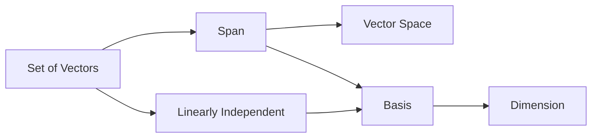
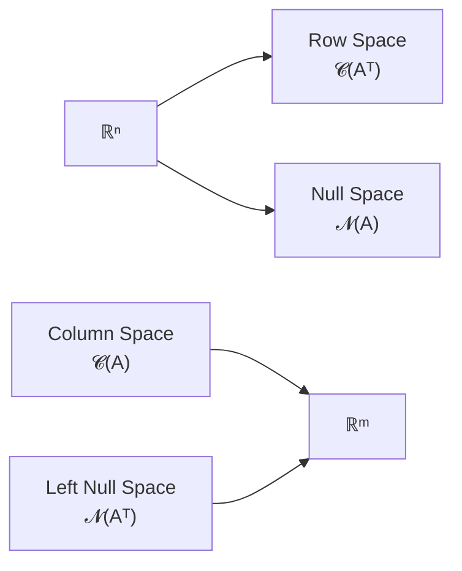

A linear equation is an equation of the form $a_1x_1 + a_2x_2 + . . . + a_nx_n = b$
where $x_1, x_2, . . . , x_n$ are the variables (or unknowns) and $a_1, a_2, . . . , a_n$ are the co-efficients which are real numbers, b is also a real number

## System of linear equations

We have mentioned earlier that one of the applications of matrices is to solve system
of linear equations. In this section we will study in detail how we can use matrices
to do so. Let us start with an example from our day to day life.

Suppose the purchases of A, B and C are given in the following
table.

| Items | Buyer A | Buyer B | Buyer C |
| --- | --- | --- | --- |
| Rice (in Kg) | 8 | 12 | 3 |
| Dal (in Kg) | 8 | 5 | 2 |
| Oil (in Kg) | 4 | 7 | 5 |

Suppose A paid Rs.1960, B paid Rs.2215 and C paid Rs.1135. We want to find
the price of each items using this data. Suppose price of Rice is Rs.x per kg., price
of dal is Rs.y per kg., price of oil is Rs.z per liter. Hence we have the following
**system of linear equations:**

$8x + 8y + 4z = 1960 \\
12x + 5y + 7z = 2215 \\
3x + 2y + 5z = 1135$
can be represented as Ax = b , where

$$
A =\begin {bmatrix}8& 8& 4\\
12 &5& 7\\
3 &2 &5\end{bmatrix}
x =\begin{bmatrix}x\\y\\z\end{bmatrix}
b =\begin{bmatrix}1960\\
2215\\
1135\end{bmatrix}

$$

where A is an m × n matrix, x is a column vector with n entries and b is a columnvector with m entries.

!Screenshot 2023-06-30 at 16-14-30 How to Solve a System of Linear Equations.png

!Screenshot 2023-06-30 at 16-14-15 How to Solve a System of Linear Equations.png

Simple checking shows that, x = 45, y = 125, z = 150 satisfies the equations. We
are not mentioning here how this solution can be obtained, that we will do in the
next chapter. But for now, we want you to verify that these values satisfy all the
three equations simultaneously.

# Solutions of linear system of equations

A linear system may behave in any one of three possible ways:

1. The system has infinitely many solutions.
2. The system has a single unique solution.
3. The system has no solution.

!Screenshot 2023-06-30 at 16-14-41 How to Solve a System of Linear Equations.png

Lets see some example when a system of linear equations has three variables with one or more than one equations

!Screenshot 2023-06-30 at 16-28-53 Section 3.4 Systems of Equations in 3 Variables.png

## CRAMER’S RULE

Condition to satisfy to be able to apply cramer:

1. Number of unknown = Number o equations
2. Coefficient matrix should be invertible

(**A matrix is invertible if it is squire matrix and the determinant of it is not zero)**

Consider a system of linear equations as follows:

$\begin{array}{l} a_{11}x_1 + a_{12}x_2 + a_{13}x_3 = b_1\\
a_{21}x_1 + a_{22}x_2 + a_{23}x_3 = b_2\\
a_{31}x_1 + a_{32}x_2 + a_{33}x_3 = b_3 \end {array}$

Let the matrix representation of the above system be $Ax = b$, where 

$A = \begin {bmatrix}a11&a12&a13\\
a21 & a22 & a23 \\
a31 & a32 & a33 \end {bmatrix} \ x=\begin {bmatrix} x_1 \\ x_2 \\ x_3 \end {bmatrix} \ b=\begin {bmatrix} b_1 \\ b_2 \\ b_3 \end {bmatrix}$


$$
\begin{alignedat}{2}
&\textbf{Replace the first column with }\mathbf{b} &&\\
&A_{x_1}=
\begin{bmatrix}
b_1&a_{12}&a_{13}\\
b_2&a_{22}&a_{23}\\
b_3&a_{32}&a_{33}
\end{bmatrix}
&\qquad&
x_1=\frac{\det(A_{x_1})}{\det(A)}
\\[10pt]
&\textbf{Replace the second column with }\mathbf{b} &&\\
&A_{x_2}=
\begin{bmatrix}
a_{11}&b_1&a_{13}\\
a_{21}&b_2&a_{23}\\
a_{31}&b_3&a_{33}
\end{bmatrix}
&\qquad&
x_2=\frac{\det(A_{x_2})}{\det(A)}
\\[10pt]
&\textbf{Replace the third column with }\mathbf{b} &&\\
&A_{x_3}=
\begin{bmatrix}
a_{11}&a_{12}&b_1\\
a_{21}&a_{22}&b_2\\
a_{31}&a_{32}&b_3
\end{bmatrix}
&\qquad&
x_3=\frac{\det(A_{x_3})}{\det(A)}
\end{alignedat}
$$


### Steps of Cramer's Rule

1. Compute $\det(A)$.
2. Compute $\det(A_{x_1})$, $\det(A_{x_2})$, and $\det(A_{x_3})$.
3. Calculate

$$
x_i=\frac{\det(A_{x_i})}{\det(A)},
\qquad i=1,2,3.
$$

That is,

$$
\begin{aligned}
x_1 &= \frac{\det(A_{x_1})}{\det(A)},\\
x_2 &= \frac{\det(A_{x_2})}{\det(A)},\\
x_3 &= \frac{\det(A_{x_3})}{\det(A)}.
\end{aligned}
$$

### Finding the solution of a system of linear equations with an invertible coefficient matrix

Inverse of the coefficient matrix methode can be applicable only to the system **iif the coefficient matrix is invertible**. That is if the **matrix is square and the determinant of the matrix is non zero**. 

Consider a system of linear of linear equations $Ax = b$ where A is an invertible matrix. Then solution of the system of linear equations can be obtain as follows:
$Ax = b$
Pre- multiplication of $A^{−1}$ both sides, we get,

$A^{−1}Ax = A^{−1}b  \implies x = A^{−1}b$

$$
A =\begin {bmatrix}a_{11}& a_{12}& ... & a_{1n}\\
a_{21} &a_{22}&...&a_{2n}\\
\vdots & \vdots & \vdots & \vdots \\a_{n1}& a_{n2}& ... & a_{nn}\end{bmatrix}
x =\begin{bmatrix}x_1\\x_2\\ \vdots \\ x_n\end{bmatrix}
b =\begin{bmatrix}b_1\\
b_2\\ \vdots \\
b_n\end{bmatrix}
$$

$\boxed{A^{−1} = \cfrac {adj(A)}{det(A)}}\\
A.A^{-1}= A . \cfrac {1}{det(A)} . adj(A)\\
=  \cfrac {1}{det(A)} . adj(A).A = I$

### Solving a system

$$
\begin{align*} Ax &=b \\ A^{-1}Ax &= A^{-1}b \quad (\text{Pre-multiply with  } A^{-1}) \\ 
Ix &= A^{-1}b \\ 
x &= A^{-1}b \end{align*}
$$

***   $if \quad cAx=b \quad then \quad x=\frac{1}{c}.A^{-1}b$

Step-1 Find the inverse of the matrix A.
Step-2 Find the matrix multiplication of $A^{−1}$ with b, i.e. $A^{−1}b$ which is a column
matrix.
step-3 Compare with the column matrix x and find the value of $x_1, x_2, . . . x_n$

**Homogenious system of linear equations** : 

$Ax=b \ where \ b=0$

$Ax=0$ 

$x=A^{-1} 0 = 0$

## Existence of Solutions

An invertible matrix satisfies

$$
A \text{ is invertible}
\iff
\begin{cases}
A \text{ is square},\\
\det(A)\neq 0.
\end{cases}
$$

---

### Homogeneous System

$$
Ax=0
$$

$$
\begin{cases}
A \text{ is invertible}
&\Longrightarrow&
\text{Unique solution }(x=0),
\\[8pt]
A \text{ is not invertible}
&\Longrightarrow&
\text{Infinitely many solutions.}
\end{cases}
$$

---

### Non-Homogeneous System

$$
Ax=b
$$

$$
\begin{cases}
A \text{ is invertible}
&\Longrightarrow&
\text{Unique solution},
\\[8pt]
A \text{ is not invertible}
&\Longrightarrow&
\text{Either no solution or infinitely many solutions.}
\end{cases}
$$

## Gaussian elimination method

Ax=b from this system we create augmented matrix [A|b] and then perform row reduction of the augmented metrix to obtain [R|c]. R is RREF of A

The solution of Ax=b is the solution of Rx=c

!!! success "Unique Solution"

**Condition**

$$
\operatorname{rank}(A)=\operatorname{rank}([A|b])=n
$$

$$
\begin{bmatrix}
1&0&0&|&a\\
0&1&0&|&b\\
0&0&1&|&c
\end{bmatrix}
$$

---

!!! failure "No Solution"

**Condition**

$$
\operatorname{rank}(A)\ne\operatorname{rank}([A|b])
$$

$$
\begin{bmatrix}
1&0&0&|&a\\
0&1&0&|&b\\
0&0&0&|&c
\end{bmatrix},
\qquad c\ne0
$$

---

!!! info "Infinitely Many Solutions"

**Condition**

$$
\operatorname{rank}(A)=\operatorname{rank}([A|b])<n
$$

$$
\begin{bmatrix}
1&0&0&|&a\\
0&1&0&|&b\\
0&0&0&|&0
\end{bmatrix}
$$

    At least one free variable exists.
# **Vector**

## Vector Space
# Vector Space

## Definition

A **vector space** over a field $\mathbb{F}$ (such as $\mathbb{R}$ or $\mathbb{C}$) is a set $V$ equipped with two operations:

1. **Vector Addition**

   $$
   + : V \times V \rightarrow V
   $$

2. **Scalar Multiplication**

   $$
   \cdot : \mathbb{F} \times V \rightarrow V
   $$

These operations must satisfy the following axioms for all

$$
\mathbf{u},\mathbf{v},\mathbf{w}\in V
\qquad\text{and}\qquad
a,b\in\mathbb{F}.
$$

---

# Vector Space Axioms

## 1. Addition Axioms

### Associativity

$$
\mathbf{u}+(\mathbf{v}+\mathbf{w})
=
(\mathbf{u}+\mathbf{v})+\mathbf{w}
$$

### Commutativity

$$
\mathbf{u}+\mathbf{v}
=
\mathbf{v}+\mathbf{u}
$$

### Additive Identity

There exists a zero vector $\mathbf{0}\in V$ such that

$$
\mathbf{u}+\mathbf{0}
=
\mathbf{u}
$$

### Additive Inverse

For every vector $\mathbf{u}\in V$, there exists $-\mathbf{u}\in V$ such that

$$
\mathbf{u}+(-\mathbf{u})
=
\mathbf{0}
$$

---

## 2. Scalar Multiplication Axioms

### Compatibility

$$
a(b\mathbf{u})
=
(ab)\mathbf{u}
$$

### Multiplicative Identity

$$
1\mathbf{u}
=
\mathbf{u}
$$

where $1$ is the multiplicative identity of $\mathbb{F}$.

### Distributivity over Scalar Addition

$$
(a+b)\mathbf{u}
=
a\mathbf{u}+b\mathbf{u}
$$

### Distributivity over Vector Addition

$$
a(\mathbf{u}+\mathbf{v})
=
a\mathbf{u}+a\mathbf{v}
$$

---

# Closure Property

A set is a vector space only if it is **closed** under both operations:

- Vector addition
- Scalar multiplication

That is,

$$
\mathbf{u},\mathbf{v}\in V
\quad\Longrightarrow\quad
\mathbf{u}+\mathbf{v}\in V
$$

and

$$
a\in\mathbb{F},
\;
\mathbf{u}\in V
\quad\Longrightarrow\quad
a\mathbf{u}\in V.
$$

---

# Example

Consider the vector space

$$
(\mathbb{R}^2,+,\cdot)
$$

where the operations are the usual addition and scalar multiplication.

### Vector Addition

$$
+:\mathbb{R}^2\times\mathbb{R}^2
\rightarrow
\mathbb{R}^2
$$

$$
(x_1,y_1)+(x_2,y_2)
=
(x_1+x_2,\;y_1+y_2)
$$

### Scalar Multiplication

$$
\cdot:\mathbb{R}\times\mathbb{R}^2
\rightarrow
\mathbb{R}^2
$$

$$
c(x,y)
=
(cx,cy)
$$

---

## Important Note

The vector space is **not defined by** $\mathbb{R}^2$ alone.

It is defined by

$$
(V,+,\cdot)
$$

where:

- $V$ is the set,
- $+$ is the vector addition operation,
- $\cdot$ is the scalar multiplication operation.

For example,

$$
(\mathbb{R}^n,+,\cdot)
$$

is a vector space **only if** the addition and scalar multiplication satisfy all eight vector space axioms.
## Vector Subspace

# Vector Subspace

## Definition

Let $V$ be a vector space over a field $\mathbb{F}$.

A subset

$$
W \subseteq V
$$

is called a **vector subspace** (or simply a **subspace**) of $V$ if $W$ itself is a vector space under the **same vector addition** and **same scalar multiplication** defined on $V$.

---

# Subspace Test

A subset $W \subseteq V$ is a subspace **if and only if** it satisfies the following three conditions.

## 1. Contains the Zero Vector

$$
\mathbf{0}\in W
$$

---

## 2. Closed Under Addition

For every

$$
\mathbf{u},\mathbf{v}\in W,
$$

their sum also belongs to $W$.

$$
\mathbf{u}+\mathbf{v}\in W
$$

---

## 3. Closed Under Scalar Multiplication

For every

$$
\mathbf{u}\in W
\quad\text{and}\quad
a\in\mathbb{F},
$$

the scalar multiple also belongs to $W$.

$$
a\mathbf{u}\in W
$$

---

# Alternative One-Step Test

Instead of checking closure under addition and scalar multiplication separately, we can verify the following condition.

If

$$
\mathbf{0}\in W,
$$

and for every

$$
\mathbf{u},\mathbf{v}\in W,
\qquad
a,b\in\mathbb{F},
$$

we have

$$
a\mathbf{u}+b\mathbf{v}\in W,
$$

then $W$ is a subspace of $V$.

---

# Summary

A subset $W$ is a subspace of $V$ if it satisfies:

| Condition | Mathematical Form |
|-----------|-------------------|
| Contains the zero vector | $\mathbf{0}\in W$ |
| Closed under addition | $\mathbf{u},\mathbf{v}\in W \Rightarrow \mathbf{u}+\mathbf{v}\in W$ |
| Closed under scalar multiplication | $\mathbf{u}\in W,\ a\in\mathbb{F}\Rightarrow a\mathbf{u}\in W$ |

---

!!! tip "Quick Memory Trick"

To check whether a subset is a subspace, remember **ZAS**:

- **Z** → Zero vector belongs to the set.
- **A** → Closed under Addition.
- **S** → Closed under Scalar multiplication.

Or use the **one-step test**:

$$
a\mathbf{u}+b\mathbf{v}\in W
$$

for all $\mathbf{u},\mathbf{v}\in W$ and all scalars $a,b$.

## linear combination

Definition : Let V be a vector space and $v_1, v_2, ..., v_n ∈ V$ . Then
$∑ _{i=1}^n α_iv_i$ is said to be a linear combination of the vectors $v_1, v_2, ..., v_n$ with coefficients $α_1, α_2, ..., α_n ∈ \R.$
Note that the linear combination of a set of vectors is another vector in V , since a vector space is closed under addition and scalar multiplication.

## Linear Dependence and Independence

# Linear Dependence and Independence

## Definition

Let

$$
\{\mathbf{v}_1,\mathbf{v}_2,\ldots,\mathbf{v}_k\}
$$

be a set of vectors in a vector space $V$ over a field $\mathbb{F}$.

Consider the linear combination

$$
c_1\mathbf{v}_1
+c_2\mathbf{v}_2
+\cdots
+c_k\mathbf{v}_k
=
\mathbf{0},
\qquad
c_1,c_2,\ldots,c_k\in\mathbb{F}.
$$

---

# Linearly Independent

The vectors are **linearly independent** if the above equation has **only the trivial solution**.

That is,

$$
c_1=c_2=\cdots=c_k=0.
$$

Equivalently,

> No vector in the set can be written as a linear combination of the others.

---

# Linearly Dependent

The vectors are **linearly dependent** if the equation has a **non-trivial solution**.

That is,

$$
\exists\; c_i\neq0
\quad
\text{for at least one } i.
$$

Equivalently,

> At least one vector can be expressed as a linear combination of the remaining vectors.

---

# Matrix Test

Construct the matrix

$$
A=
\begin{bmatrix}
| & | & & |\\
\mathbf{v}_1 & \mathbf{v}_2 & \cdots & \mathbf{v}_k\\
| & | & & |
\end{bmatrix}.
$$

Then:

## If $A$ is Square

### Linearly Independent

$$
\det(A)\neq0
$$

or equivalently,

$$
\operatorname{rank}(A)=k.
$$

---

### Linearly Dependent

$$
\det(A)=0
$$

or equivalently,

$$
\operatorname{rank}(A)<k.
$$

---

# General Rank Test

The determinant test works **only for square matrices**.

The rank test works for **every matrix**.

| Condition | Conclusion |
|-----------|------------|
| $\operatorname{rank}(A)=k$ | Linearly Independent |
| $\operatorname{rank}(A)<k$ | Linearly Dependent |

where $k$ is the number of vectors (columns).

---

# Intuition

## Independent

Each vector contributes a **new direction**.

```text
v₁ ↗

v₂ →

v₃ ↑
```

None of them can be created using the others.

---

## Dependent

One vector is redundant.

```text
v₃ = 2v₁ - v₂
```

So the set contains unnecessary information.

---

# Example 1 (Independent)

Consider

$$
\mathbf{v}_1=
\begin{bmatrix}
1\\0
\end{bmatrix},
\qquad
\mathbf{v}_2=
\begin{bmatrix}
0\\1
\end{bmatrix}.
$$

Then

$$
A=
\begin{bmatrix}
1&0\\
0&1
\end{bmatrix},
$$

and

$$
\det(A)=1\neq0.
$$

Hence, the vectors are **linearly independent**.

---

# Example 2 (Dependent)

Consider

$$
\mathbf{v}_1=
\begin{bmatrix}
1\\2
\end{bmatrix},
\qquad
\mathbf{v}_2=
\begin{bmatrix}
2\\4
\end{bmatrix}.
$$

Since

$$
\mathbf{v}_2=2\mathbf{v}_1,
$$

the vectors are **linearly dependent**.

The corresponding matrix is

$$
A=
\begin{bmatrix}
1&2\\
2&4
\end{bmatrix},
$$

and

$$
\det(A)=0.
$$

---

## Quick Summary

| Property | Linearly Independent | Linearly Dependent |
|----------|----------------------|--------------------|
| Solution of $A\mathbf{x}=0$ | Only trivial solution | Non-trivial solution exists |
| Determinant (square matrix) | $\det(A)\neq0$ | $\det(A)=0$ |
| Rank | $\operatorname{rank}(A)=k$ | $\operatorname{rank}(A)<k$ |
| Redundant vectors | No | Yes |
| Basis candidate | Yes | No |

!!! tip "Memory Trick"

**Independent → "Nothing can be removed."**

**Dependent → "At least one vector is unnecessary."**

## Linear dependence

Definition: A set of vectors ${v_1, v_2, ..., v_n}$ is said to be linearly dependent, if
there exist scalars $α_1, α_2, ..., α_n ∈ \R.$. not all zero, such that 

$$
α_1v_1 +α_2v_2 +...+α_nv_n = 0.\\
α_1, α_2, ..., α_n ∈ \R.
 \\ 
\text{in this equation if any one of the α is non zero then the set is dependent set } \\
α_1, α_2, ..., α_n \ne 0 \ (should \ be)
$$

- A set of vectors *v*1,*v*2,...*vn*∈*V* is said to be linearly dependent if there exist scalars $*a_1,a_2,...a_n∈R*$, not all zero such that $*a_1v_1+a_2v_2+...+a_nv_n=0*$.
- To check the vectors $*v_1,v_2,...v_n∈R^m*$ (with usual addition and scalar multiplication) are linearly dependent, we have to verify that the homogeneous system of linear quations *Ax*=0 has infinitely many solutions, where the $*j-th*$ column of $*A*$ is $*v_j*$.

In other words, a set of vectors is linearly dependent if the zero vector can be
written as a linear combination of those vectors with at least one of the coefficients
being non-zero. Geometrically, any two vectors that lie on the same line, any three
vectors that lie on the same plane, etc., are linearly dependent.
From our earlier discussion, {(4, 5), (2, 1), (1, 2)}, {(3, 7, 2), (0, 2, 1), (2, 2, 0)} are
linearly dependent sets. Notice that both the sets contain 3 vectors that lie on the
same plane.

## Linear independence

Definition : A set of vectors ${v_1, v_2, ..., v_n}$ is said to be linearly independent if
they are not linearly dependent. In other words, if there exist $α_1, α_2, ..., α_n ∈ \R.$ such that

If a set is linearly independent, then the only linear combination of these vectors
that can yield the zero vector is when all the coefficients are zero.

$$
α_1v_1 +α_2v_2 +...+α_nv_n = 0\\then \ α_i = 0  \ for  \ all \ i.
$$

singleten set is always Independent set . coz . $a.(3,2) = 0$ only if $a=0$

- A set of vectors *v*1,*v*2,...*vn*∈*V* is said to be linearly independent if *a*1*v*1+*a*2*v*2+...+*anvn*=0 implies that *ai*=0 for *i*=1,2,...*n*.
- To check the vectors *v*1,*v*2,...*vn*∈R*m* (with usual addition and scalar multiplication) are linearly independent, we have to verify that the homogeneous system of linear equations *Ax*=0 has only the trivial solution (i.e., *x*=0), where the *jth* column of *A* is *vj*.
- If *S* is a set containing zero vector, then the set *S* is a linearly dependent set.
- Let *S* be a set of vectors from a vector space *V*. If an element of *S* is a scalar multiple of another element from the set *S*, then *S* is a linearly dependent set.

- Given two vectors $(x_1,y_1), and (x_2,y+2)∈ \R^2$ construct $*A=\begin{bmatrix}x_1 & y_1 \\x_2 &y_2\end{bmatrix}*$. Then these vectors are linearly dependent if and only if $*det(A)=0*$ and linearly independent if and only if $*det(A)\ne0*$.
- Given three vectors $(x_1,y_1,z_1),(x_2,y_2,z_2) \ and (x_3,y_3,z_3)∈ \R^3$ construct
 $*A=\begin{bmatrix}x_1 &x_2&x_3  \\y_1 &y_2 &y_3 \\ z_1 & z_2 &z_3\end{bmatrix}*$. Then these vectors are 
linearly dependent if and only if $*det(A)=0*$ and 
linearly independent if and only if $*det(A)\ne0*$
    
    
    - Any set of *n* vectors in R2 with *n*≥3 is linearly dependent.
    - Any set of *n* vectors in R3 with *n*≥4 is linearly dependent.
    - Any set of *n*+1 vectors in R*n* is linearly dependent.
    - Any set containing a linearly dependent set is linearly dependent.
    - If a set is linearly independent, then every subset of it, is linearly independent.

!Untitled

## Other ways to check linear independence

Let us recall what we do to check whether a set ${v_1, v_2, ..., v_n}$ is linearly independent or not.
We solve the equation $α_1v_1 + α_2v_2 + ... + α_nv_n = 0$(zero vector) for arbitrary real numbers $α_1, α_2, ..., α_n$. Expanding this system, we get a homogeneous system of equations. Thus checking linear independence reduces to solving a system of linear equations, where the coefficients of the vectors are the unknowns. We know that a homoge-
neous system is always consistent, that is, a homogeneous system always has a solution. The zero vector is always a solution, but the question is, are there other non-zero solutions. If $α_1v_1 + α_2v_2 + ... + α_nv_n = 0$ reduces to a system which has only the trivial solution, then the set is linearly independent. If we get a non-zero
solution, then the set is linearly dependent. Note that we are not interested in the solution, we are only interested in finding whether the system has a unique solution (the trivial solution) or infinitely many solutions.
To conclude, to check whether the set ${v_1, v_2, ..., v_n}$ is linearly independent or not, we need to verify whether the homogeneous system V x = 0 has only the trivial solution or not, where V is the matrix whose jth column is the vector vj . Note that if the matrix V is square, then the only thing we need to verify is whether the
determinant of V is non-zero or not. (Why?)

**Example .** Consider the set {(1, 1), (2, 0)}. Clearly this set of vectors is linearly independent because they are not scalar multiples of each other. Now, we get a 2 × 2 matrix V since we have 2 vectors with 2 components each. We need to solve the equation a(1, 1) + b(2, 0) = (0, 0). This reduces to
a + 2b = 0
a = 0
The matrix V is nothing but,$\begin{bmatrix} 1& 2\\ 1 & 0\end{bmatrix}$
 . V is an invertible matrix and hence the vectors
are linearly independent.
**Example** . Consider the set {(1, 2, 3), (2, −1, 4)}. To form the coefficient matrix,
we put the vectors as columns of V . We get a 3 × 2 matrix since we have 2 vectors
and each vector has 3 components. The homogeneous system we get is
a + 2b = 0
2a − b = 0
3a + 4b = 0
Using Gaussian elimination, we can verify whether that the system has a unique
solution and hence the set is linearly independent.

# Span and Basis

# Span and Basis

## Span

Let

$$
S=\{\mathbf{v}_1,\mathbf{v}_2,\ldots,\mathbf{v}_k\}
$$

be a set of vectors in a vector space $V$ over a field $\mathbb{F}$.

The **span** of $S$ is the set of all possible linear combinations of the vectors in $S$.

$$
\operatorname{Span}(S)
=
\left\{
c_1\mathbf{v}_1+c_2\mathbf{v}_2+\cdots+c_k\mathbf{v}_k
\;\middle|\;
c_i\in\mathbb{F}
\right\}
$$

### Property

$$
\operatorname{Span}(S)
$$

is always a **subspace** of $V$.

---

# Basis

A set

$$
S=\{\mathbf{v}_1,\mathbf{v}_2,\ldots,\mathbf{v}_k\}
$$

is called a **basis** of a vector space $V$ if it satisfies **both** of the following conditions.

## 1. Linear Independence

The vectors in $S$ are linearly independent.

---

## 2. Spanning Property

The vectors span the entire vector space.

$$
\operatorname{Span}(S)=V
$$

---

# Dimension

The **dimension** of a vector space $V$, denoted by

$$
\dim(V),
$$

is the **number of vectors in any basis** of $V$.

If a basis contains $k$ vectors, then

$$
\boxed{\dim(V)=k.}
$$

---

# Standard Bases

## Standard Basis of $\mathbb{R}^n$

The standard basis is

$$
\mathcal{E}
=
\{\mathbf{e}_1,\mathbf{e}_2,\ldots,\mathbf{e}_n\},
$$

where

$$
\mathbf{e}_i
=
\begin{bmatrix}
0\\
\vdots\\
1\\
\vdots\\
0
\end{bmatrix}
$$

(the $i^{\text{th}}$ entry is 1 and all others are 0).

For example,

$$
\mathbb{R}^3:
\qquad
\mathbf{e}_1=
\begin{bmatrix}
1\\0\\0
\end{bmatrix},
\quad
\mathbf{e}_2=
\begin{bmatrix}
0\\1\\0
\end{bmatrix},
\quad
\mathbf{e}_3=
\begin{bmatrix}
0\\0\\1
\end{bmatrix}.
$$

---

## Standard Basis of the Polynomial Space

For

$$
\mathcal{P}_n,
$$

the standard basis is

$$
\mathcal{B}
=
\{1,x,x^2,\ldots,x^n\}.
$$

Therefore,

$$
\boxed{\dim(\mathcal{P}_n)=n+1.}
$$

---

# Relationship Between Span, Basis, and Dimension



---

# Summary

| Concept | Meaning |
|----------|---------|
| **Span** | All possible linear combinations of a set of vectors |
| **Basis** | A linearly independent set that spans the entire vector space |
| **Dimension** | Number of vectors in a basis |
| **Standard Basis of $\mathbb{R}^n$** | $\{\mathbf{e}_1,\mathbf{e}_2,\ldots,\mathbf{e}_n\}$ |
| **Standard Basis of $\mathcal{P}_n$** | $\{1,x,x^2,\ldots,x^n\}$ |

---

!!! tip "Memory Trick"

**Span → Reach**

> "What vectors can I **reach** using linear combinations?"

**Basis → Minimum Reach**

> "The **smallest independent set** that can reach every vector."

**Dimension → Count**

> "How many vectors are needed in a basis?"

# Spanning sets

Let us begin this section by defining the span of a set. The span of a set is roughly all the vectors that can be got by using the given set of vectors.

**Definition** : The span of a set S, denoted by span(S) is the set of all finite linear combinations of the elements of the set S. That is,$span(S) = \{  \sum_{i=1}^{n} α_iv_i | v_i \isin V, α_i ∈ R \}$

The span of a set *S* (of vectors) is defined as the set of all finite linear combinations of elements (vectors) of *S* and denoted by *Span*(*S*) i.e.,

$span(S) = \{  \sum_{i=1}^{n} α_iv_i  \isin V| a_1,a_2, ... a_n∈ \R \ and \ v_1,v_2,... ,v_n \isin S  \}$

Let *V* be a vector space. A set *S* ⊆ *V* is spanning set for *V* if  *Span*(*S*)=*V*

> $Span(S)=V$ (Vector space) , means we should be able to generat any point of the vector space by usin the spanning set. 
OR 
We can say every point of the vector space should be in linear combination with the elements of the spanning set.
> 
> 
> The span of S will contain all possible finite linear combinations of the elements of S
> 

Note that span(S) is a vector subspace. (Verify!)

<aside>
✅ **Span of a set S** (or Vector space) = {**All the linearly independent elements** } + some extra elements

</aside>

## Building spanning sets

We may append vectors to a set to build spanning sets for a vector space. Consider $\R^3$.
• **Step 1:** Start with S0 = ∅. Span(S0) = {(0, 0, 0)}. (Why!?)
• **Step 2:** Since span(S0)̸ = R3, append a vector, say (1, 1, 0) to S0. Now S1 = S0 ∪ {(1, 1, 0)} = {(1, 1, 0)}. span(S1) is a line in R3, which still doesn’t cover the entire space R3.
• **Step 3:** Now choose a vector outside span(S1). Let S2 = S1 ∪ {(1, 1, 1)} = {(1, 1, 0), (1, 1, 1)}. Span(S2) is the plane x = y, which still doesn’t cover R3.
• **Step 4:** We now choose a vector outside span(S2). Let S3 = S2 ∪ {(1, 0, 0)} = {(1, 1, 0), (1, 1, 1), (1, 0, 0)}. Now, it is easy to verify that S3 spans R3.
Notice that at each stage we added a vector which was not in the span of the previous vectors.

# Basis of a vector space

<aside>
✅ **The following conditions are equivalent for a set to be a basis of a vector space:**
- Maximal linearly independent set : A linearly independent set such that if any vector is appended to it, the new set is no longer linearly independent.
- Minimal spanning set : A spanning set such that if any vector is removed from the set, then the set will not be a spanning set.

</aside>

### How to find a basis of a subspace V of $M_{m\times n}(R)$:

Step 1: Consider each element of a $m \times n$ matrix as a variable. So there are mn number of variables.
Step 2: Using the constraints given as the defination of the subspace separate out the independent and the dependent variables. Suppose there are k independent variables and $mn - k$ dependent variables.
Step 3: Define a matrix $M_1$ by assigning 1 to one independent variable and 0 to all the other independent variables,
together with finding out the values of all the dependent variables.
Step 4: Repeat this process for all the independent variables to get the vectors $M_2, M_3, ... , M_k$.
The set of matrices {$M_1, M_2, ...., M_k$ } forms a basis of V. Hence the dimension of V is k in this case.

### Finding basis in RREF form

- write vector as the row of the matrix, then find the RREF . In RREF non-zero rows are the basis of the vector space.
- write vector as the column of the matrix, then find the RREF. In RREF find the pivot columns and the vectors related to thouse inthe original vector set. thouse vectors will form basis for the vector space.

## **Rank and Dimension of a matrix:**

1. **Rank of a Matrix**:
    - The rank of a matrix is the **maximum number of linearly independent rows or columns** in the matrix.
    - It is a measure of the dimension of the vector space spanned by the rows or columns of the matrix.
    - The rank of a matrix is often denoted as "rank(A)" for a matrix A.
    - The rank is a non-negative integer value.
    - If the rank of a matrix is equal to the number of its rows (or columns), it is said to have full rank.
2. **Dimension of a Matrix**:
    - The dimension of a matrix is often used to refer to the number of rows and columns in the matrix.
    - For a matrix A with m rows and n columns, it is often described as an "m x n" matrix, where "m" is the number of rows and "n" is the number of columns.
    - The dimension simply gives you the size or shape of the matrix.

The rank and dimension are related in the following way:

- The rank of a matrix is always less than or equal to the minimum of the number of rows and columns. That is, if you have an m x n matrix, then the rank of the matrix is at most min(m, n).
- If the rank of a matrix is equal to min(m, n), the matrix is said to have full rank, which means that its rows and columns are linearly independent. This implies that the dimension of the row space and the column space is the same and equal to the rank of the matrix.

<aside>
✅ the rank of a matrix tells you how many linearly independent rows or columns it has, while the dimension of a matrix simply provides its size or shape in terms of the number of rows and columns. These concepts are important in various applications of linear algebra, such as solving systems of linear equations, studying linear transformations, and understanding the properties of matrices.

</aside>

- **How to find rank of a matrix A**:
- Reduce the matrix to row echelon form.
- Find the number of non zero rows in the reduced matrix which will be the rank of the matrix A.

Matrix $\rightarrow$ RRF  $\begin {cases} \text{number of non-zero row} &Row \ Rank \rightarrow \text{Dim of column apace} \\ \text{number of non-zero column} &Column\  Rank \rightarrow \text{Dim of row space} \end{cases}$

**Row space (A) $\ne$ Column space(A)
but (Dim must be same)
Row rank(A) = Column rank (A) = rank of A**

Finding rank of a matrix using minor method

$\textbf{Example:} \text{ Find the rank of the matrix } \rho(A) \text{ if } A = \begin{bmatrix} 1 & 2 & 3 \\ 4 & 5 & 6 \\ 7 & 8 & 9 \end{bmatrix}. \\[10pt]\textbf{Solution:} \\[5pt]A \text{ is a square matrix and so we can find its determinant.} \\[8pt]\begin{aligned}\det(A) &= 1(45 - 48) - 2(36 - 42) + 3(32 - 35) \\&= -3 + 12 - 9 \\&= 0\end{aligned} \\[8pt]\text{So } \rho(A) \neq \text{order of the matrix. i.e., } \rho(A) \neq 3. \\[10pt]\text{Now, we will see whether we can find any non-zero minor of order 2.} \\[8pt]\begin{vmatrix} 1 & 2 \\ 4 & 5 \end{vmatrix} = 5 - 8 = -3 \neq 0. \\[10pt]\text{So there exists a minor of order 2 (or } 2 \times 2\text{) which is non-zero. So the rank} \\\text{of } A\text{, } \rho(A) = 2.$

# The Four Fundamental Subspaces

# The Four Fundamental Subspaces

Let

$$
A \in \mathbb{R}^{m\times n}
$$

be a matrix of rank

$$
r.
$$

The matrix $A$ maps vectors from

$$
\mathbb{R}^n \longrightarrow \mathbb{R}^m.
$$

There are **four fundamental subspaces** associated with every matrix.

---

# The Four Subspaces

| Subspace | Notation | Definition | Dimension |
|----------|----------|------------|-----------|
| **Column Space (Range)** | $\mathcal{C}(A)$ | $\{\mathbf{b}\in\mathbb{R}^m \mid \mathbf{b}=A\mathbf{x},\ \mathbf{x}\in\mathbb{R}^n\}$ | $r$ |
| **Row Space** | $\mathcal{C}(A^T)$ | $\{\mathbf{y}\in\mathbb{R}^n \mid \mathbf{y}=A^T\mathbf{w},\ \mathbf{w}\in\mathbb{R}^m\}$ | $r$ |
| **Null Space (Kernel)** | $\mathcal{N}(A)$ | $\{\mathbf{x}\in\mathbb{R}^n \mid A\mathbf{x}=\mathbf{0}\}$ | $n-r$ |
| **Left Null Space** | $\mathcal{N}(A^T)$ | $\{\mathbf{y}\in\mathbb{R}^m \mid A^T\mathbf{y}=\mathbf{0}\}$ | $m-r$ |

---

# Where Do They Live?

| Subspace | Lives In |
|----------|----------|
| Column Space | $\mathbb{R}^m$ |
| Left Null Space | $\mathbb{R}^m$ |
| Row Space | $\mathbb{R}^n$ |
| Null Space | $\mathbb{R}^n$ |

---

# Visual Picture



---

# Orthogonality Relations

## In $\mathbb{R}^n$

The **Row Space** and **Null Space** are orthogonal complements.

$$
\boxed{
\mathcal{C}(A^T)
\perp
\mathcal{N}(A)
}
$$

---

## In $\mathbb{R}^m$

The **Column Space** and **Left Null Space** are orthogonal complements.

$$
\boxed{
\mathcal{C}(A)
\perp
\mathcal{N}(A^T)
}
$$

---

# Rank–Nullity Theorem

Since

$$
\dim(\mathcal{C}(A))=r
$$

and

$$
\dim(\mathcal{N}(A))=n-r,
$$

we obtain

$$
\boxed{
\dim(\mathcal{C}(A))
+
\dim(\mathcal{N}(A))
=
r+(n-r)
=
n
}
$$

Similarly,

$$
\boxed{
\dim(\mathcal{C}(A^T))
+
\dim(\mathcal{N}(A^T))
=
r+(m-r)
=
m
}
$$

---

# Relationships

| Property | Formula |
|----------|---------|
| Rank | $\dim(\mathcal{C}(A))=\dim(\mathcal{C}(A^T))=r$ |
| Nullity | $\dim(\mathcal{N}(A))=n-r$ |
| Left Nullity | $\dim(\mathcal{N}(A^T))=m-r$ |
| Rank–Nullity | $r+(n-r)=n$ |
| Row Space ⟂ Null Space | $\mathcal{C}(A^T)\perp\mathcal{N}(A)$ |
| Column Space ⟂ Left Null Space | $\mathcal{C}(A)\perp\mathcal{N}(A^T)$ |

---

!!! info "Memory Trick"

Think of the four subspaces in **pairs**.

**Inside $\mathbb{R}^n$**
- Row Space
- Null Space

These are orthogonal complements.

**Inside $\mathbb{R}^m$**
- Column Space
- Left Null Space

These are also orthogonal complements.

The dimensions of each pair always add up to the dimension of the ambient space.

- $r+(n-r)=n$
- $r+(m-r)=m$

## Column Space

 The column space of the $m\times n$ matrix A is the subspace C(A) of $\R^m$ spanned by the columns of A

The column space of a matrix, also known as the column span or the range of the matrix, is a fundamental concept in linear algebra. It refers to the subspace of a vector space that is spanned by the columns of a given matrix. In other words, the column space is the set of all possible linear combinations of the columns of the matrix.

Mathematically, if you have an m x n matrix A, the column space of A is denoted as Col(A) or C(A) and is defined as:

$Col(A) = \text{Span\{column vectors of A\}}$

The column space is a subspace of the vector space ℝ^m (the set of all m-dimensional real-valued vectors) because the columns of the matrix are m-dimensional vectors.

Key points about the column space:

1. The column space represents all the possible linear combinations of the columns of the matrix A. It describes the range of the linear transformation defined by the matrix A.
2. The dimension of the column space is equal to the rank of the matrix. This means that the column space has a dimension equal to the number of linearly independent columns in the matrix.
3. The column space is important in various applications, including solving systems of linear equations, understanding the properties of linear transformations, and determining whether a system of equations has a solution.
4. The column space provides insight into the relationships between the columns of the matrix and helps in understanding the structure and properties of the matrix.

In summary, the column space of a matrix is the vector subspace spanned by its columns, and it is a fundamental concept in linear algebra used to analyze the properties and behavior of matrices in various mathematical and practical contexts.

!Untitled

!Untitled

## Row Space

The row space of a matrix, also known as the row span, is another important concept in linear algebra. It refers to the subspace of a vector space that is spanned by the rows of a given matrix. In other words, the row space is the set of all possible linear combinations of the rows of the matrix.

Mathematically, if you have an m x n matrix A, the row space of A is denoted as Row(A) or R(A) and is defined as:

$Row(A) = \text{ Span\{row vectors of A\}}$

Key points about the row space:

1. The row space represents all the possible linear combinations of the rows of the matrix A. It describes the range of the linear transformation defined by the transpose of the matrix A, often denoted as A^T.
2. The dimension of the row space is equal to the rank of the matrix. This means that the row space has a dimension equal to the number of linearly independent rows in the matrix.
3. The row space is closely related to the column space of the transpose of the matrix (i.e., the column space of A^T), and they have the same dimension.
4. The row space is used in various applications, including solving systems of linear equations, understanding the properties of linear transformations, and determining whether a system of equations has a solution.
5. The row space provides insight into the relationships between the rows of the matrix and helps in understanding the structure and properties of the matrix.

In summary, the row space of a matrix is the vector subspace spanned by its rows, and it is a fundamental concept in linear algebra used to analyze the properties and behavior of matrices in various mathematical and practical contexts.
# Row Space

## Definition

The **row space** of a matrix $A$ is the subspace spanned by the rows of $A$.

$$
\operatorname{Row}(A)
=
\operatorname{span}
\{\text{rows of }A\}
$$

---

## Example

Suppose

$$
\operatorname{rref}(A)=
\begin{bmatrix}
1&0&1\\
0&1&1\\
0&0&0
\end{bmatrix}.
$$

The row space is

$$
\operatorname{Row}(A)
=
\operatorname{span}
\{
(1,0,1),
(0,1,1)
\}.
$$

(The zero row is ignored.)

A general vector in the row space is

$$
\alpha(1,0,1)
+
\beta(0,1,1),
\qquad
\alpha,\beta\in\mathbb R.
$$

Simplifying,

$$
=
(\alpha,\beta,\alpha+\beta).
$$

Let

$$
x=\alpha,\qquad
y=\beta,\qquad
z=\alpha+\beta.
$$

Then

$$
\boxed{
\operatorname{Row}(A)
=
\{
(x,y,z)\in\mathbb R^3
\mid
z=x+y
\}.
}
$$

or equivalently,

$$
\boxed{
x+y-z=0.
}
$$

---

## Dimension

$$
\boxed{
\dim(\operatorname{Row}(A))
=
\operatorname{rank}(A)
}
$$

---

## Basis

$$
\boxed{
\{
(1,0,1),
(0,1,1)
\}
}
$$

---

# Larger Example

Let

$$
A=
\begin{bmatrix}
-3&6&-1&1&7\\
1&-2&2&3&-1\\
2&-4&5&8&-4
\end{bmatrix}.
$$

Its reduced row echelon form is

$$
\operatorname{rref}(A)=
\begin{bmatrix}
1&-2&0&-1&3\\
0&0&1&2&-2\\
0&0&0&0&0
\end{bmatrix}.
$$

---

# Basis of the Row Space

The basis consists of the **non-zero rows** of the RREF.

$$
u_1=
(1,-2,0,-1,3)
$$

$$
u_2=
(0,0,1,2,-2)
$$

Hence,

$$
\boxed{
\operatorname{Basis}(\operatorname{Row}(A))
=
\{u_1,u_2\}
}
$$

Since each row has five components,

$$
u_1,u_2\in\mathbb R^5.
$$

---

# Column Space

## Important Rule

The pivot columns are identified from the **RREF**, but the basis vectors are taken from the **original matrix**.

---

The pivot columns of

$$
\operatorname{rref}(A)
=
\begin{bmatrix}
\boxed{1}&-2&\boxed{0}&-1&3\\
0&0&\boxed{1}&2&-2\\
0&0&0&0&0
\end{bmatrix}
$$

are

- Column 1
- Column 3

Therefore, the basis vectors come from **Columns 1 and 3 of the original matrix**.

$$
v_1=
\begin{bmatrix}
-3\\
1\\
2
\end{bmatrix}
$$

$$
v_2=
\begin{bmatrix}
-1\\
2\\
5
\end{bmatrix}
$$

Hence,

$$
\boxed{
\operatorname{Basis}(\operatorname{Col}(A))
=
\{v_1,v_2\}
}
$$

Since each vector has three entries,

$$
v_1,v_2\in\mathbb R^3.
$$

---

# Summary

| Subspace | How to Find the Basis |
|-----------|-----------------------|
| **Row Space** | Non-zero rows of $\operatorname{rref}(A)$ |
| **Column Space** | Pivot columns of the **original** matrix (pivot locations found from $\operatorname{rref}(A)$) |
| **Null Space** | Solve $A\mathbf{x}=0$ |
| **Left Null Space** | Solve $A^T\mathbf{y}=0$ |

!!! warning "Common Mistake"

**Row Space:** Use the **non-zero rows of the RREF**.

**Column Space:** **Do not** use the columns of the RREF.

Find the pivot positions from the RREF, then take the corresponding columns from the **original matrix**.

> **RREF tells you *which columns*.**
>
> **The original matrix gives you *the basis vectors*.**

# Null Space (Kernel)

# Null Space (Kernel)

## Definition

Let

$$
A \in \mathbb{R}^{m\times n}.
$$

The **null space** (or **kernel**) of $A$, denoted by

$$
\mathcal{N}(A)
\quad\text{or}\quad
\operatorname{Null}(A),
$$

is the set of all vectors

$$
\mathbf{x}\in\mathbb{R}^n
$$

that satisfy

$$
A\mathbf{x}=\mathbf{0}.
$$

---

## Mathematical Definition

The null space is

$$
\boxed{
\mathcal{N}(A)
=
\{
\mathbf{x}\in\mathbb{R}^n
\mid
A\mathbf{x}=\mathbf{0}
\}.
}
$$

---

## Important Properties

### 1. Subspace

The null space is always a **subspace** of the domain.

$$
\boxed{
\mathcal{N}(A)\subseteq\mathbb{R}^n
}
$$

---

### 2. Dimension (Nullity)

If

- $n$ = number of columns of $A$
- $r$ = rank of $A$

then

$$
\boxed{
\dim(\mathcal{N}(A))
=
n-r.
}
$$

This quantity is called the **nullity** of the matrix.

---

# How to Find the Null Space

## Step 1

Reduce the matrix to **Reduced Row Echelon Form (RREF)**.

$$
A
\longrightarrow
\operatorname{rref}(A)
$$

---

## Step 2

Identify

- Pivot columns
- Free variables

---

## Step 3

Solve the homogeneous system

$$
A\mathbf{x}
=
\mathbf{0}
$$

Express every pivot variable in terms of the free variables.

---

## Step 4

Write the solution in parametric vector form.

Example

$$
\mathbf{x}
=
s
\begin{bmatrix}
1\\
0\\
2
\end{bmatrix}
+
t
\begin{bmatrix}
0\\
1\\
-1
\end{bmatrix}.
$$

---

## Step 5

The vectors multiplying the free parameters form a basis of the null space.

Hence,

$$
\boxed{
\operatorname{Basis}(\mathcal{N}(A))
=
\left\{
\begin{bmatrix}
1\\
0\\
2
\end{bmatrix},
\begin{bmatrix}
0\\
1\\
-1
\end{bmatrix}
\right\}.
}
$$

---

# Example

Consider

$$
A=
\begin{bmatrix}
1&2&1\\
2&4&2
\end{bmatrix}.
$$

Its RREF is

$$
\operatorname{rref}(A)=
\begin{bmatrix}
1&2&1\\
0&0&0
\end{bmatrix}.
$$

The system

$$
x_1+2x_2+x_3=0
$$

has two free variables.

Let

$$
x_2=s,
\qquad
x_3=t.
$$

Then

$$
x_1=-2s-t.
$$

Therefore,

$$
\mathbf{x}
=
\begin{bmatrix}
-2s-t\\
s\\
t
\end{bmatrix}
=
s
\begin{bmatrix}
-2\\
1\\
0
\end{bmatrix}
+
t
\begin{bmatrix}
-1\\
0\\
1
\end{bmatrix}.
$$

Hence,

$$
\boxed{
\mathcal{N}(A)
=
\operatorname{span}
\left\{
\begin{bmatrix}
-2\\
1\\
0
\end{bmatrix},
\begin{bmatrix}
-1\\
0\\
1
\end{bmatrix}
\right\}.
}
$$

---

# Summary

| Property | Result |
|----------|--------|
| Definition | $\mathcal{N}(A)=\{\mathbf{x}\mid A\mathbf{x}=0\}$ |
| Lives in | $\mathbb{R}^n$ |
| Dimension | $n-r$ |
| Name of Dimension | Nullity |
| Basis | Obtained from the parametric solution of $A\mathbf{x}=0$ |
| Type | Subspace of $\mathbb{R}^n$ |

---

## Relationship with Rank

The null space satisfies the **Rank–Nullity Theorem**.

$$
\boxed{
\operatorname{rank}(A)
+
\operatorname{nullity}(A)
=
n.
}
$$

where $n$ is the number of columns of $A$.

---

!!! tip "Memory Trick"

The **Null Space** answers the question:

> **"Which vectors become zero after multiplying by \(A\)?"**

Remember:

- **Column Space** → Outputs of \(A\)
- **Row Space** → Independent equations
- **Null Space** → Inputs that produce zero
- **Left Null Space** → Outputs orthogonal to the column space

The null space of a matrix, also known as the kernel, is an important concept in linear algebra. It is a subspace of the vector space from which the matrix's columns are taken and represents the set of vectors that, when multiplied by the matrix, result in the zero vector. In other words, it contains all the solutions to the homogeneous equation $Ax = 0$, where A is the matrix.

Mathematically, if you have an m x n matrix A, the null space of A is denoted as $Null(A) \ or \  N(A)$ and is defined as:

$Null(A) = \{x | Ax = 0\}$


Key points about the null space:

1. The null space represents all the possible vectors x such that when multiplied by the matrix A, the result is the zero vector.
2. The null space is a subspace of the vector space $ℝ^n$ (the set of all n-dimensional real-valued vectors).
3. The dimension of the null space is often called the nullity of the matrix and is denoted as $nullity(A)$. It is related to the rank of the matrix (rank(A)) through the Rank-Nullity Theorem, which states that for any matrix A, $rank(A) + nullity(A) = n$, where n is the number of columns in A.
4. The null space is useful for understanding solutions to linear systems of equations, particularly homogeneous systems. If the null space is nontrivial (i.e., it contains vectors other than the zero vector), it means that the system of equations has infinitely many solutions.
5. The null space is closely related to the concept of linear independence and dependence. Vectors in the null space are linearly dependent because they satisfy the equation $Ax = 0$ with nontrivial solutions.

In summary, the null space of a matrix is the subspace of vectors that, when multiplied by the matrix, yield the zero vector. It plays a crucial role in understanding the solutions of linear systems and the relationships between the columns of the matrix. The dimension of the null space, known as the nullity, is linked to the rank of the matrix and is a fundamental concept in linear algebra.

Null space of A and RREF(A)

A and RREF(A) heave the same null space
R=RREF(A)
there exist some invertable matrix E such that 
R=EA

x $\in$ null space(A)
Ax=0

EAx=0

Rx=0

x $\in$ null space(R)

# Rank-Nullity Theorem

$\textbf{The Rank-Nullity Theorem} \\[5pt]\text{Let } A \text{ be an } m \times n \text{ matrix over a field } \mathbb{F}. \text{ The theorem states that the sum of the} \\[3pt]\text{dimension of the column space and the dimension of the null space equals the number of columns.} \\[10pt]\textbf{The Theorem Formula:} \\[8pt]\quad \boxed{\text{Rank}(A) + \text{Nullity}(A) = n} \\[12pt]\begin{aligned}&\textbf{Component Breakdowns:} \\&\quad \text{• Rank } (\text{Rank}(A)): && \dim(\mathcal{C}(A)) \implies \text{Number of pivot columns in RREF.} \\&\quad \text{• Nullity } (\text{Nullity}(A)): && \dim(\mathcal{N}(A)) \implies \text{Number of free variables in RREF.} \\&\quad \text{• Columns } (n): && \text{The total number of columns in matrix } A \text{ (dimension of the domain).}\end{aligned} \\[12pt]\textbf{Linear Transformation Formulation:} \\[5pt]\text{If } T: V \to W \text{ is a linear transformation where } V \text{ is finite-dimensional, then:} \\[5pt]\quad \dim(\text{Im}(T)) + \dim(\text{Ker}(T)) = \dim(V)$

Let A be an $m \times n$ matrix
- row rank of A is the dimension of the row space of A
- column rank of A is the dimension of the column space of A
these are equal and are denoted by rank(A)
rank(A) is calculated as the number of  non-zero rows of the matrix R in RREF

number of non-zero rows = number of dependent variables

Hence,
**rank(A)
= number of non-zero rows of R
= numbero of dependent variables of Rx=0**

nullity (A) = number of independent variables of Rx=0
Theorem === For and $m \times n$ matrix A, $rank(A) + nullity(A)=n$

Rank of matrix : Maximum number of liniearly independent column vectors ( or row vectros) in a matrix.

Note: Rank of a matrix is always less than or equal to the number of columns(or rows)

**How to find rank of a matrix A:**
step 1: Reduce the matrix to row echelon from:
step 2: Find the number of non zero rows in the REF matrix which will be the rank of the matrix A

if $A$ is a $m\times n$ matrix and $B$ is an $n \times p$ matrix, then the product $AB$ is an $m \times p$ matrix.

**Rank-nullity theoremm tells us that:**
$nullity(AB)=nullity(B) - rank(A)$
$Rank(A-B) \le Rank(A) + Rank(B)$

$rank(A) \le  min\{m,n\}$, where A is an m x n matrix.
$rank(AB) \le min\{rank(A), rank(B)\}$

So when we were doing row reduction to find the RREF . we ware doing adition and scaler multiplications. that is basically linear combinations of some rows. we ware trying to find any row is in linear combinations with others.

$\Large Ax=b$  (this is a non-Homogenious equation)

| $Ax=b$ |  |
| --- | --- |
| $det(A) \ne 0$ | - linearly independent
- unique solution |
| $det(A)= 0$ | - linearly dependent
- no / infinite solution |

$\Large Ax=0$  (this is a Homogenious equation)

| $Ax=0$ |  |
| --- | --- |
| $det(A) \ne 0$ | - linearly independent
- unique solution

- full rank and Nullity = 0

- Identity matrix after RRRF

- dimention of row space = dimention of collum space = n

- vectors in row and column are linearly independent |
| $det(A)= 0$ | - linearly dependent
- infinit solution |

$$
\R^2\begin{cases}\{(non\ zero \ vector)\} & always \ independent \\ \{(),()\} & check \ determinant \\ \{(),(), ()\} & \text{ always dependent}\end{cases}
$$

$$
\R^3\begin{cases}\{(non\ zero \ vector)\} & always \ independent \\ \{(),()\} & always \ independent \\
\{(),(),()\} & check \ determinant \\ \{(),(), (),()\} & \text{always dependent}\end{cases}
$$

## Situations when a set of vectors can not form a subspace

$W=\{ \left( x,y,z\right) | z= xy\}$ >>> if there is a product it will not form a subspace

$W=\{ \left( x,y,z\right) | x+y+z= 1\}$  >>> if there is a non-zero constant it will not form subspace

$W=\left\{ \left( x,y,\sin \left( x\right) \right) | x,y\in \mathbb{R} \right\}$  >>> if there is a trigonometry it will not form subspace

$W=\{ \left( x,y,z\right) | z= x^{2}+y^{2}\}$ >>> if there is power more then 1, it will not form subspace

$T : \R ^n \rightarrow \R^m$

$$
\text{for homogenious equation there two possible solutions} \\homogenious =\begin{cases} Inversible &unique \ solution & linearly  \ indipendent \\ not-inversible &infinit \ solution & linearly\ dipendent\end{cases}
$$

$$
Invertable \implies \text{matrix A is squire and }det(A) \neq 0\\ \\  homogenious\begin{cases} invertable  & unique \ solution \\ not-invertable  &infinite \ solution \end{cases} \\ 
non \ homogenious\begin{cases} invertable  & unique \ solution \\ not-invertable  &no/infinite \ solution \end{cases}  
$$

# Linear Transformation

# Linear Transformation Cheat Sheet

**Definition:** Let $V$ and $W$ be vector spaces over the same field $\mathbb{F}$. A mapping $T: V \to W$ is called a *linear transformation* if it satisfies the following two conditions for all $\mathbf{u}, \mathbf{v} \in V$ and $c \in \mathbb{F}$:

### 1. Core Conditions
* **Additivity:** 
  $$T(\mathbf{u} + \mathbf{v}) = T(\mathbf{u}) + T(\mathbf{v})$$
* **Homogeneity:** 
  $$T(c\mathbf{u}) = cT(\mathbf{u})$$

### 2. Alternative Single-Step Test
You can merge both conditions into a single statement to check for linearity in one step:
$$T(a\mathbf{u} + b\mathbf{v}) = aT(\mathbf{u}) + bT(\mathbf{v}) \quad \forall \, \mathbf{u}, \mathbf{v} \in V, \;\; \forall \, a, b \in \mathbb{F}$$

### 3. Fundamental Properties
Every linear transformation automatically guarantees these algebraic behaviors:

* **Zero Vector Mapping:** 

  $$T(\mathbf{0}_V) = \mathbf{0}_W$$

* **Additive Inverse:** 

  $$T(-\mathbf{u}) = -T(\mathbf{u})$$

* **Matrix Representation:** 

  $$T(\mathbf{x}) = A\mathbf{x}$$

  *(where $A$ is the standard matrix of the transformation)*


A functions between vector spaces. A function that transform vector from one vector space to another vector space. and preserve the structure of that spaces. 

**Definasion**: Let V and W be two vector spaces over the same field. A functor $T : V \rightarrow W$ is called a linear map or transformation that satisfies the properties -

### Properties of a Linear Transformation

Let $T: V \to W$ be a linear transformation from vector space $V$ to vector space $W$:

1. **Additivity (Preservation of Addition):**

   $$T(v_1 + v_2) = T(v_1) + T(v_2) \quad \forall \, v_1, v_2 \in V$$

2. **Homogeneity (Preservation of Scalar Multiplication):**

   $$T(cv) = cT(v) \quad \forall \, v \in V, \; c \in \mathbb{F}$$

3. **Zero Vector Mapping Property:**

   $$T(\underbrace{\mathbf{0}_V}_{\text{Zero of } V}) = \underbrace{\mathbf{0}_W}_{\text{Zero of } W}$$


Matrix transformation $T: \mathbb R^n \rightarrow \mathbb R^m$ defined by matrix $A_{m \times n}$ . Transformation is encoded in the matrix $A$. (we take one vector from the domain ‘V’, and multiply it with A . we will get the result vector in the codomain ‘W’)

$\boxed {\huge T(v)=Av}$

Ex: 
### Example 1: $T: \mathbb{R}^2 \to \mathbb{R}^2$
$$\begin{aligned}
T(x,y) &= (9x+5y, \; 7x-10y) \quad \text{(Transformation Definition)} \\
&= \begin{bmatrix} 9 & 5 \\ 7 & -10 \end{bmatrix} \begin{bmatrix} x \\ y \end{bmatrix}
\end{aligned}$$

### Example 2: $T: \mathbb{R}^2 \to \mathbb{R}^3$
$$\begin{aligned}
T(x,y) &= (x+3y, \; x-2y, \; 2x+5y) \quad \text{(Transformation Definition)} \\
&= \begin{bmatrix} 1 & 3 \\ 1 & -2 \\ 2 & 5 \end{bmatrix} \begin{bmatrix} x \\ y \end{bmatrix}
\end{aligned}$$

**Remark** : $T(x,y) = (x,0)$ is a linear map but $T(x,y) = (x,1)$ is not a linear map . so there can not be a scaler rather then $zero$ or $x^2$ or $xy$ or $y^2$ . it should be linear combination of x and y. 

**Theorem** : If $T: V \rightarrow W$ is a linear transformation,
then 
a. $T(0) = 0$
b. $T(-v) = - T(v)$

!Untitled

## Injective mapping (one to one)

!only one pre image goes to one image

only one pre image goes to one image

$T(v_1)=T(v_2) \implies v_1 = v_2$

$T$ is injective (linear transformation) iff $T(v) =0 \implies v=0$   (only zero of the domain is going to the zero of the range)

If the linear transformation $T:\R^n → \R^m$ is one-one, then  $n ≤ m$. and it can not be $n>m$

$A_{m \gt n} = \begin{bmatrix} 1 & 2 \\ 3 & 4 \\ 5 & 6\end{bmatrix} \qquad
A_{m=n} =  \begin{bmatrix} 1 & 2 \\ 3 & 4 \end{bmatrix}$

$\text{Properties of  injective,} \\
Rank(T) = dim(v) \\ Nullity(T)=0 \\ Kernel(T) <=> \{0\}$

Given T is injective to show T(v) = 0 implies v must be ‘0’
$T(v)= T(0)\\
T(v)=0\\
T(0)=0 \\
v=0$

Given T(v)=0 implies v must be 0
to show T is injective
$T(v_1) = T(v_2)\\
T(v_1) + T(v_2)=0 \\
v_1 - v_2 =0\\
v_1=v_2\\
\text{T is injective}$

## Surjective mapping (onto)

!no extra element in co-domain

no extra element in co-domain

$codomain = range$ (that means there is no extra element in range)

$T(v) = w = Ing(T)$ then $T$ is surjective
 $Img(T) = \{ T(v) | v \in V\}$

If the linear transformation $T:\R^n → \R^m$ is onto, then $n ≥ m$.

$A_{m \lt n} = \begin{bmatrix} 1 & 2 & 3 \\ 4 & 5 & 6 \end{bmatrix} \qquad
A_{m=n} =  \begin{bmatrix} 1 & 2 \\ 3 & 4 \end{bmatrix}$

$Rank(T) = dim(w)$

$Img(T)$ must be a vector subspace

1. $o \in Ing(T) \ as \ T(0) =0$
2. $T(v_1), T(v_2) \in Img(T)\\
T(v_1) + T(v_2) = T(v_1 + v_2)\\
(v_1+v_2) \in V\\
T(v_1+v_2) \in Img(T)$
3. $T(v) \in Ing(T)\\
cT(v) = T(cv)\\
cT(v) \in Img(T)$

## Bijective mapping

!for each element in domain there is unique element in co-domain

for each element in domain there is unique element in co-domain

When T is both Injective and Surjective
T is Injective if -  $nullity(T) = 0$ 
T is Surjective if - $Rank(T) = dim(w)$
for each w $\in$ W , there exist v $\in$ V

If T is Isomorphism iff $dim(V) = dim(W)$
$Rank(T) + nullity(T) = dim(V)\\
dim(W) + 0 = dim(V)\\
dim(V)=dim(W)$

!Untitled

!Untitled

# Ordered Basis and Standard Bases
# Ordered Basis & Coordinate Vectors Cheat Sheet

**Definition:** An *ordered basis* for a finite-dimensional vector space $V$ is a basis where the vectors are kept in a specific, fixed sequence: 
$$\mathcal{B} = (\mathbf{v}_1, \mathbf{v}_2, \dots, \mathbf{v}_n)$$

### 1. Standard Ordered Bases ($\mathcal{E}$)

* **For Vector Space $\mathbb{R}^n$:**
  $$\mathcal{E} = (\mathbf{e}_1, \mathbf{e}_2, \dots, \mathbf{e}_n)$$
  $$\text{where } \mathbf{e}_1 = \begin{bmatrix} 1 \\ 0 \\ \vdots \\ 0 \end{bmatrix}, \;\; \mathbf{e}_2 = \begin{bmatrix} 0 \\ 1 \\ \vdots \\ 0 \end{bmatrix}, \;\; \dots, \;\; \mathbf{e}_n = \begin{bmatrix} 0 \\ 0 \\ \vdots \\ 1 \end{bmatrix}$$

* **For Polynomial Space $\mathcal{P}_n(x)$ (Degree $\le n$):**
  $$\mathcal{E} = (1, x, x^2, \dots, x^n)$$

* **For Matrix Space $M_{2 \times 2}(\mathbb{R})$:**
  $$\mathcal{E} = \left( \begin{bmatrix} 1 & 0 \\ 0 & 0 \end{bmatrix}, \;\; \begin{bmatrix} 0 & 1 \\ 0 & 0 \end{bmatrix}, \;\; \begin{bmatrix} 0 & 0 \\ 1 & 0 \end{bmatrix}, \;\; \begin{bmatrix} 0 & 0 \\ 0 & 1 \end{bmatrix} \right)$$

---

### 2. Coordinate Vector Notation

If a vector $\mathbf{x}$ is expressed as a unique linear combination of your ordered basis vectors:
$$\mathbf{x} = c_1\mathbf{v}_1 + c_2\mathbf{v}_2 + \dots + c_n\mathbf{v}_n$$

Then the unique coordinate column vector relative to $\mathcal{B}$ is written as:
$$[\mathbf{x}]_\mathcal{B} = \begin{bmatrix} c_1 \\ c_2 \\ \vdots \\ c_n \end{bmatrix} \in \mathbb{R}^n$$


# Matrix Equivalence vs. Matrix Similarity

# Matrix Equivalence vs. Matrix Similarity

Let $A$ and $B$ be matrices over a field $\mathbb{F}$. These two relations represent different levels of structural transformation in linear algebra.

---

### 1. Equivalent Matrices ($A \sim B$)

* **Context:** $A$ and $B$ are $m \times n$ rectangular matrices (not necessarily square).
* **Algebraic Definition:** 
$$B = PAQ \quad \text{where } P \in M_m(\mathbb{F}) \text{ and } Q \in M_n(\mathbb{F}) \text{ are invertible matrices}$$

* **Geometric Meaning:** $A$ and $B$ represent the *same* linear transformation $T: V \to W$ under an independent change of bases in **both** the domain and codomain.
* **Core Invariant:** Equivalent matrices share the exact same **Rank**.

---

### 2. Similar Matrices ($A \approx B$)

* **Context:** $A$ and $B$ must be square matrices ($n \times n$).
* **Algebraic Definition:** 
$$B = P^{-1}AP \quad \text{where } P \in M_n(\mathbb{F}) \text{ is an invertible change-of-basis matrix}$$

* **Geometric Meaning:** $A$ and $B$ represent the *same* linear operator $T: V \to V$ with respect to a change of a single, uniform basis $\mathcal{B}$.

* **Core Invariants:** Similar matrices share a massive set of spectral properties:
  $$\text{Rank}, \;\; \det(A), \;\; \text{Trace}(A), \;\; \text{Eigenvalues}, \;\; \text{Characteristic Polynomial}, \;\; \text{and Invertibility}$$


# Affine Subspace
# Affine Subspace (Flat) Cheat Sheet

**Definition:** Let $V$ be a vector space over a field $\mathbb{F}$, and let $W \subseteq V$ be a valid vector subspace. An *affine subspace* $A$ of $V$ is a translated copy of $W$ shifted by a fixed displacement vector $\mathbf{x}_0 \in V$.

---

### 1. Mathematical Formulations

* **Set Notation:** 
  $$A = \mathbf{x}_0 + W = \{ \mathbf{x}_0 + \mathbf{w} \mid \mathbf{w} \in W \}$$
* **Dimension:** 
  $$\dim(A) = \dim(W)$$
* **Core Geometry:** An affine subspace does *not* have to contain the origin $\mathbf{0}$ *(unless $\mathbf{x}_0 \in W$, in which case $A = W$)*.

---

### 2. Alternative Characterization (Affine Combinations)

A subset $A \subseteq V$ is an affine subspace if and only if for any vectors $\mathbf{u}, \mathbf{v} \in A$ and any scalar $t \in \mathbb{F}$:
$$(1 - t)\mathbf{u} + t\mathbf{v} \in A$$
*(This implies geometric closure under lines passing through any two points in the subset).*

---

### 3. Geometric Examples in $\mathbb{R}^3$

* **Dimension 0 (Point):** A single translated coordinate point: 
  $$\{\mathbf{x}_0\}$$
* **Dimension 1 (Line):** A line that does not necessarily pass through the origin: 
  $$\mathbf{x} = \mathbf{x}_0 + t\mathbf{v}$$
* **Dimension 2 (Plane):** A flat plane that does not necessarily pass through the origin: 
  $$\mathbf{x} = \mathbf{x}_0 + s\mathbf{v}_1 + t\mathbf{v}_2$$
