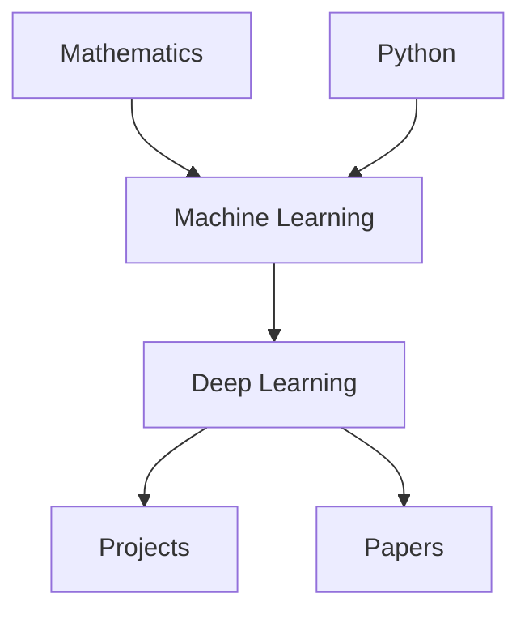

#  Notes

Welcome! 👋

This website contains my personal notes, explanations, mathematical derivations, code examples, and learning resources related to **Machine Learning**, **Deep Learning**, and **Artificial Intelligence**.

The goal of this project is to build a structured knowledge base that helps me revise concepts quickly while also serving as a public resource for anyone interested in ML.

---

## 📚 Learning Roadmap



---

## 📖 Topics

### 📐 Mathematics
- Linear Algebra
- Probability
- Statistics
- Calculus
- Optimization

---

### 🤖 Machine Learning
- Perceptron
- Linear Regression
- Logistic Regression
- Gradient Descent
- Decision Trees
- Random Forest
- Support Vector Machines
- Naive Bayes
- K-Means Clustering
- Principal Component Analysis (PCA)

---

### 🧠 Deep Learning
- Neural Networks
- Backpropagation
- Activation Functions
- Regularization
- CNN
- RNN
- LSTM
- Attention
- Transformers

---

### 💻 Frameworks
- NumPy
- Pandas
- Matplotlib
- Scikit-Learn
- PyTorch
- TensorFlow

---

### 🚀 Projects

A collection of machine learning projects with:
- Problem Statement
- Dataset
- Model Architecture
- Training Process
- Evaluation
- Source Code

---

### 📄 Research Papers

Summaries and explanations of important ML and DL papers.

---

### ❓ Interview Questions

Frequently asked interview questions with explanations.

---

### 📝 Cheat Sheets

Quick revision notes for:
- Common equations
- ML algorithms
- Deep learning architectures
- PyTorch API
- Probability distributions

---

## 🎯 What You'll Find

Each topic generally includes:

- 📖 Intuition
- 🧮 Mathematical Derivation
- 📊 Visual Explanation
- 💻 Python Implementation
- ⚙️ Complexity Analysis
- ✅ Advantages & Limitations
- 📌 Key Takeaways
- 🔗 References

---

## 🌟 Recommended Learning Path

1. Mathematics
2. Python & NumPy
3. Machine Learning Fundamentals
4. Model Evaluation
5. Deep Learning
6. Computer Vision
7. Natural Language Processing
8. Generative AI
9. Research Papers
10. Real-world Projects

---

## 📂 Repository Structure

```text
docs/
├── math/
├── machine-learning/
├── deep-learning/
├── pytorch/
├── tensorflow/
├── projects/
├── papers/
├── interview/
├── cheatsheets/
└── images/
```

---

## 📈 Progress Tracker

| Section | Status |
|---------|--------|
| Mathematics | 🚧 |
| Machine Learning | 🚧 |
| Deep Learning | 🚧 |
| PyTorch | 🚧 |
| Projects | 🚧 |
| Papers | 🚧 |

---

## 📬 Contributing

If you notice any mistakes or have suggestions, feel free to open an issue or submit a pull request.

Happy Learning! 🚀
