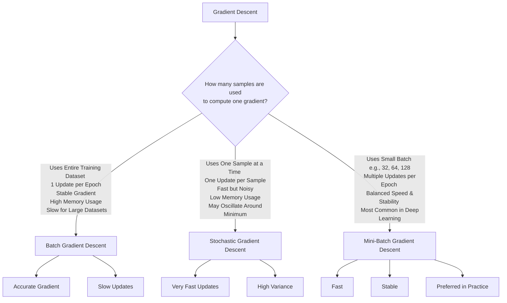
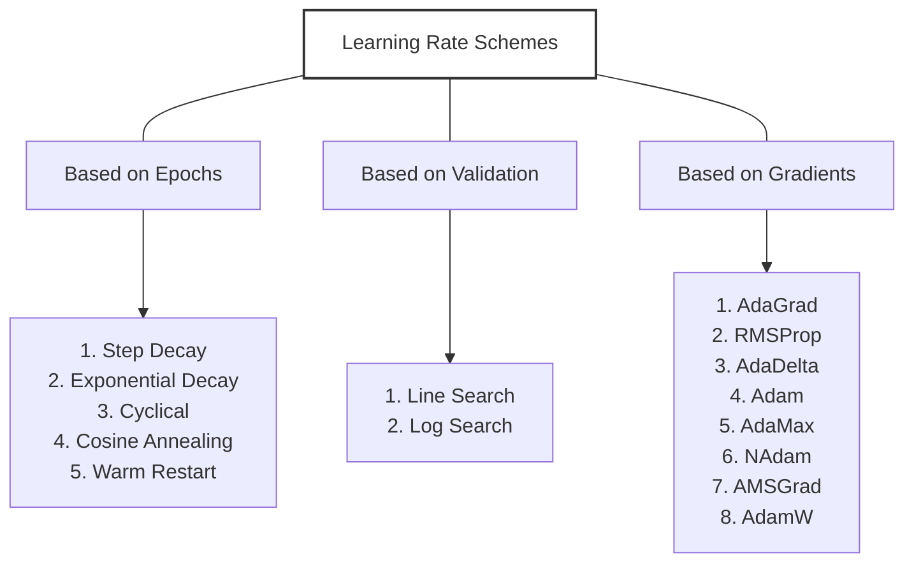

# Optimization Algorithm


# 🔵 Gradient Descent
### The Foundation

**Gradient descent is an iterative optimization algorithm that uses the gradient (first-order derivative) of the loss function to find local minima.** The algorithm is based on a simple intuition: to minimize a function, move in the direction of steepest descent.

## 🧮 The Mathematics

Let’s start from **vanilla (basic) gradient descent**:

$$\theta_{t+1} = \theta_t - \eta \nabla_\theta L(\theta_t)$$

Where:

- $\theta_t$→ parameters (weights) at step *t*
- $\eta$→ learning rate (step size) - a hyperparameter controlling the magnitude of updates
- $\nabla_\theta L()$ - derivative of loss function w.r.t parameters
- $\nabla_\theta L(\theta_t)$ → gradient of loss at current weights

### **Geometric Interpretation**

The gradient **$∇_θL(θₜ)$** points in the direction of **steepest ascent**. By moving in the negative gradient direction $(-∇_θL(θₜ))$, we move toward lower loss values, eventually reaching a local minimum.

### **Key Properties**

| **Property** | **Description** | **Implication** |
| --- | --- | --- |
| **First-Order Method** | Uses only first derivatives (gradients) | Computationally efficient, widely applicable |
| **Iterative** | Updates parameters step-by-step | Allows monitoring and early stopping |
| **Local Optimization** | Converges to local minima, not necessarily global | Initial parameters and learning rate matter |
| **Scalable** | Works with large datasets and high dimensions | Foundation for deep learning optimization |

**Key Characteristics:**

1. **Simple and intuitive**: Directly follows the negative gradient
2. **Fixed learning rate**: Same step size for all parameters and iterations
3. **No memory**: Each update is independent of previous updates
4. **Guaranteed convergence** for convex functions with appropriate learning rate

**Limitations:**

- Oscillates in ravines (areas with steep curvature in one dimension and gentle in another)
- Slow convergence in regions with small gradients
- Requires careful learning rate tuning
- Gets stuck in local minima or saddle points

### **Types of Gradient Descent**

**The primary distinction between gradient descent variants lies in how many training samples are used to compute the gradient at each iteration.** This fundamental choice creates a trade-off between computational efficiency and gradient accuracy.

---



---

# 🔵 Batch Gradient Descent (BGD)

**Batch Gradient Descent uses the entire dataset to compute gradients at each iteration.** This provides the most accurate gradient estimate but is computationally expensive for large datasets.

### **Algorithm**

## Batch Gradient Descent for Linear Regression

**Initialize:** \(w\) and \(b\) randomly.

**For each epoch:**

- **Compute predictions for all samples:**

   $$
   \hat{y}_i = wx_i + b
   $$

- **Compute the Mean Squared Error (MSE) loss:**

   $$ L = \frac{1}{n}\sum_{i=1}^{n}(y_i - \hat{y}_i)^2 $$

- **Compute gradients using all samples:**

   $$  dw = \frac{2}{n}\sum_{i=1}^{n}(\hat{y}_i-y_i)x_i $$

   $$ db = \frac{2}{n}\sum_{i=1}^{n}(\hat{y}_i-y_i) $$

- **Update the parameters:**

   $$ w \leftarrow w - \eta\,dw $$

   $$ b \leftarrow b - \eta\,db $$


### **3.2.2 Characteristics**

| **Aspect** | **Description** |
| --- | --- |
| **Gradient Quality** | Exact gradient of full loss function |
| **Convergence** | Smooth, deterministic path to local minimum |
| **Computation** | O(n·d) per iteration - expensive for large n |
| **Memory** | Requires loading entire dataset |
| **Updates per Epoch** | 1 update per complete pass through data |

# 🔵 Stochastic Gradient Descent (SGD)

**Stochastic Gradient Descent uses a single randomly selected sample to compute gradients at each iteration.** This provides fast updates with noisy gradients, enabling online learning and escape from poor local minima.

### **Algorithm**

Initialize: w, b randomly
For each epoch:
    Shuffle dataset
    For each sample $(xᵢ, yᵢ):$
        1. Compute prediction: $ŷᵢ = w·xᵢ + b$
        2. Compute loss for single sample: $L = (yᵢ - ŷᵢ)²$
        3. Compute gradients using single sample:
           $dw = 2·(ŷᵢ - yᵢ)·xᵢ$
           $db = 2·(ŷᵢ - yᵢ)$
        4. Update parameters immediately:
           $w = w - η·dw$
           $b = b - η·db$

### **Characteristics**

| **Aspect** | **Description** |
| --- | --- |
| **Gradient Quality** | Noisy approximation of true gradient |
| **Convergence** | Fluctuating path, may not converge to exact minimum |
| **Computation** | O(d) per iteration - very fast |
| **Memory** | Minimal - processes one sample at a time |
| **Updates per Epoch** | n updates (one per sample) |
| **Special Properties** | Can escape shallow local minima, enables online learning |

# 🔵 Mini-Batch Gradient Descent (MBGD)

**Mini-Batch Gradient Descent uses small batches of samples to compute gradients.** This balances the accuracy of BGD with the speed of SGD, and is the most commonly used variant in modern deep learning.

### **Algorithm**


```text
Initialize w, b randomly

For each epoch:
    Shuffle the dataset
    Divide the dataset into batches of size b

    For each batch B:
        1. Compute predictions:
           ŷ = w · X_batch + b

        2. Compute batch loss:
           L = (1/b) Σ (y_batch - ŷ)²

        3. Compute gradients:
           dw = (2/b) Σ (ŷ - y_batch) · X_batch
           db = (2/b) Σ (ŷ - y_batch)

        4. Update parameters:
           w = w - η · dw
           b = b - η · db
```


### **Characteristics**

| **Aspect** | **Description** |
| --- | --- |
| **Gradient Quality** | Smoothed approximation, better than SGD |
| **Convergence** | Moderately smooth, good balance |
| **Computation** | O(b·d) per iteration - efficient and parallelizable |
| **Memory** | Moderate - processes one batch at a time |
| **Updates per Epoch** | n/b updates |
| **Special Properties** | GPU-friendly, best practice for deep learning |

### **Batch Size Selection**

Common batch sizes: 32, 64, 128, 256

- **Small batches** (16-32): More noise, better generalization, memory efficient
- **Large batches** (256-512): Smoother convergence, faster computation, more memory


---
!!! info "Next Topic"


# 🔵 Momentum-based Gradient Descent

## 💡 Intuitive Idea

Imagine rolling a **ball down a hill** (the loss surface).

- **Plain Gradient Descent**: The ball moves slowly and zigzags if the hill is steep and curved.
- **Momentum Gradient Descent**: The ball builds **speed** in the downhill direction — it gains *momentum* and moves smoother and faster toward the bottom.

---

---

## ⚙️ With Momentum

We add a **velocity term** ($v_t$) to keep track of *past gradients*:


$$\begin{aligned}
\theta_{t+1} &= \theta_t - \eta u_t \\ 
u_t &= \beta u_{t-1} + (1 - \beta)\nabla_\theta L(\theta_t)
\end{aligned}$$

Where:

- $(u_t)$ → running average of past gradients (velocity)
- $(\beta)$ → momentum coefficient (usually between 0.8 and 0.99), (controls how much past velocity we keep)
- $(\eta)$ → learning rate

---

### 🧠 Intuition Behind Each Term

| Symbol | Meaning | Intuition |
| --- | --- | --- |
| $(u_t)$ | Velocity | Like the speed and direction of the ball |
| $(\beta u_{t-1})$ | Momentum from the past | Keeps moving in same direction if gradients point the same way |
| $((1-\beta)\nabla L)$ | Current gradient | Corrects direction if the slope changes |
| $(\eta u_t)$ | Step size | How far to move in the parameter space |

---

### 🔍 Why It Helps

1. **Smooths updates**
    - Without momentum, gradients fluctuate — the path zigzags.
    - With momentum, updates are averaged, so it moves smoothly.
2. **Speeds up convergence**
    - When gradients point in the same direction, momentum amplifies the movement.
    - The ball accelerates down consistent slopes.
3. **Reduces oscillation**
    - Especially helpful when loss surface is steep in one dimension and flat in another.

---

### 🧭 Visual Analogy

Imagine pushing a heavy ball down a bumpy hill:

- If you push gently (small learning rate), it’s slow.
- If you push too hard (high learning rate), it overshoots.
- But if the ball has **momentum**, it rolls smoothly and naturally across small bumps.

---

### 🔢 Typical Values

- Momentum ($\beta$): **0.9** (most common)
- Learning rate ($\eta$): tuned per problem, e.g., 0.01 or 0.001

---


---

**Physical Analogy:**
Imagine a ball rolling down a hill. Momentum helps the ball:

1. **Accelerate** in directions of consistent downward slope
2. **Dampen oscillations** in directions with conflicting gradients
3. **Escape shallow local minima** by maintaining velocity

**Key Advantages:**

- Faster convergence in relevant directions
- Reduced oscillations in high-curvature regions
- Better navigation through plateaus and ravines
- Helps escape saddle points

**Typical Hyperparameter Settings:**

- $\beta$ = 0.9 (standard)
- $\beta$ = 0.99 (for very large models or smooth optimization landscapes)

## 🔍 What β Controls - Summary Table


| **β Value** | **Memory of Past Gradients** | **Update Behavior** | **Advantages** | **Drawbacks** | **Typical Use** |
|:-----------:|------------------------------|---------------------|----------------|---------------|-----------------|
| **0** | No memory | Plain Gradient Descent (\(v_t=\nabla L(\theta_t)\)); updates depend only on the current gradient; slow and zig-zag | Simple and predictable | No momentum, noisy updates, slow convergence | Simple or convex optimization problems |
| **0.5** | Moderate memory (keeps ~50% of previous velocity) | Moderately smooth updates; adapts fairly quickly to changing gradients | Faster than plain SGD while remaining responsive | Less acceleration than higher momentum | Loss surfaces where gradient direction changes frequently |
| **0.9** *(default in PyTorch SGD)* | High memory (keeps ~90% of previous velocity) | Smooth updates; accelerates along consistent directions; good balance of speed and stability | Fast convergence with reduced oscillations | May be slightly less responsive to sudden changes | Default choice for most deep learning models (CNNs, RNNs, Transformers) |
| **0.99** | Very high memory | Extremely smooth updates; reacts slowly to new gradient directions | Excellent smoothing on stable loss surfaces | Sluggish adaptation; may overshoot or take longer to converge when gradients change | Very smooth optimization landscapes |
| **→ 1.0** | Almost complete memory | Velocity hardly decays; optimizer keeps nearly all past information | Strong acceleration in one direction | Overshooting, oscillations, possible failure to converge | Generally **not recommended** |


---


## 🧠 Mental Picture

- **Small β** → like a ball with *high friction* → stops quickly when slope changes.
- **Large β** → like a ball with *low friction* → keeps rolling even after slope changes.

---

✅ **In short:**

- Increasing β → smoother but slower reactions.
- Decreasing β → faster reactions but more noise.
- Practical range: **0.8 – 0.95**

---


# 🔵 Momentum-based Gradient Descent

- **Momentum-based Gradient Descent**  
  Uses past gradient information to smooth and accelerate learning.

### Update Rule

The momentum term is updated as:

$$
u_t = \beta u_{t-1} + \nabla L(w_t)
$$

with

$$
u_{-1} = 0,
\qquad
w_0 = \operatorname{rand}(),
\qquad
0 \leq \beta < 1
$$

The parameter is then updated as:

$$
w_{t+1} = w_t - \eta u_t
$$

where:

- \(u_t\) → momentum / velocity
- \(\beta\) → momentum coefficient
- \(\eta\) → learning rate
- \(\nabla L(w_t)\) → gradient of the loss at iteration \(t\)

---

### Velocity Update

An alternative, normalized formulation is:

$$
v_t
=
\beta v_{t-1}
+
(1-\beta)\nabla L(\theta_t)
$$

### Parameter Update

$$
\theta_{t+1}
=
\theta_t-\eta v_t
$$

---

### Why is Momentum an Exponentially Weighted Average of Past Gradients?

Consider the velocity update:

$$
v_t
=
\beta v_{t-1}
+
(1-\beta)\nabla L(\theta_t)
$$

Starting with

$$
v_{-1}=0
$$

we get:

**At \(t=0\):**

$$
v_0
=
(1-\beta)\nabla L(\theta_0)
$$

**At \(t=1\):**

$$
\begin{aligned}
v_1
&=
\beta v_0
+
(1-\beta)\nabla L(\theta_1) \\
&=
\beta(1-\beta)\nabla L(\theta_0)
+
(1-\beta)\nabla L(\theta_1)
\end{aligned}
$$

**At \(t=2\):**

$$
\begin{aligned}
v_2
&=
\beta v_1
+
(1-\beta)\nabla L(\theta_2) \\
&=
\beta^2(1-\beta)\nabla L(\theta_0)
+
\beta(1-\beta)\nabla L(\theta_1)
+
(1-\beta)\nabla L(\theta_2)
\end{aligned}
$$

Therefore, in general:

$$
\boxed{
v_t
=
(1-\beta)
\sum_{\tau=0}^{t}
\beta^{t-\tau}
\nabla L(\theta_\tau)
}
$$

why momentum based gradient descent is exponentially weighted average of current and all past gradients

$$
\begin{aligned}
u_t &= \beta u_{t-1} + \nabla w_t \\[4pt]
u_0 &= \nabla w_0
\qquad \because \qquad
u_{-1}=0 \\[4pt]
u_1 &= \beta u_0 + \nabla w_1 \\
    &= \beta(\nabla w_0) + \nabla w_1 \\[4pt]
u_2 &= \beta u_1 + \nabla w_2 \\
    &= \beta(\beta\nabla w_0 + \nabla w_1) + \nabla w_2 \\
    &= \beta^2\nabla w_0 + \beta\nabla w_1 + \nabla w_2 \\[4pt]
u_t &= \sum_{\tau=0}^{t} \beta^{t-\tau}\nabla w_\tau
\end{aligned}
$$


The coefficient of a gradient from the past is multiplied by an increasing power of \(\beta\).

For example:

$$
\nabla L(\theta_t)
\rightarrow (1-\beta)
$$

$$
\nabla L(\theta_{t-1})
\rightarrow (1-\beta)\beta
$$

$$
\nabla L(\theta_{t-2})
\rightarrow (1-\beta)\beta^2
$$

Thus, **recent gradients receive more weight while older gradients receive exponentially smaller weights**.

This is why momentum behaves like an **exponentially weighted moving average (EWMA)** of past gradients.

---

### Intuition

Think of momentum like **rolling a ball down a hill**.

- The gradient tells the ball which direction the slope is pointing.
- Momentum gives the ball some memory of its previous direction.
- If gradients consistently point in the same direction, momentum builds up speed.
- If gradients repeatedly change direction, the accumulated momentum smooths out the changes.

Therefore, momentum:

- Accelerates movement in consistent directions.
- Reduces oscillations.
- Helps the optimizer move through shallow regions faster.

---

### Effect of \(\beta\)

The parameter \(\beta\) controls **how much memory of previous gradients is retained**.

#### \(\beta = 0\)

The velocity update becomes:

$$
v_t
=
\nabla L(\theta_t)
$$

Therefore:

$$
\theta_{t+1}
=
\theta_t
-
\eta\nabla L(\theta_t)
$$

This is simply **ordinary gradient descent**.

There is no momentum.

**Behavior:**

- No memory of previous gradients.
- Updates can be noisy.
- Can exhibit zig-zag motion.

---

#### \(\beta = 0.5\)

$$
v_t
=
0.5v_{t-1}
+
0.5\nabla L(\theta_t)
$$

This provides **moderate smoothing**.

Useful when the gradient direction changes frequently but you still want the optimizer to respond reasonably quickly to new gradients.

---

#### \(\beta = 0.9\)

$$
v_t
=
0.9v_{t-1}
+
0.1\nabla L(\theta_t)
$$

This retains substantial information from previous gradients.

It is a common momentum value and provides a good balance between:

- Smoothness
- Speed
- Responsiveness

---

#### \(\beta = 0.99\)

$$
v_t
=
0.99v_{t-1}
+
0.01\nabla L(\theta_t)
$$

This gives **very strong momentum**.

The optimizer heavily relies on historical gradients and reacts slowly to changes in the current gradient.

**Advantages:**

- Very smooth updates.
- Useful when the loss landscape changes gradually.

**Risks:**

- Slow adaptation to new directions.
- Can overshoot.
- May become sluggish.

---

#### \(\beta = 1\)

If

$$
\beta = 1
$$

then

$$
v_t
=
v_{t-1}
+
\nabla L(\theta_t)
$$

The old velocity never decays.

Therefore, gradients from the distant past continue accumulating indefinitely.

This can cause:

- Excessive momentum.
- Overshooting.
- Instability.
- Difficulty adapting when the gradient direction changes.

Hence, in standard momentum methods:

$$
\boxed{0 \leq \beta < 1}
$$

---

### Summary

| \(\beta\) | Memory | Behavior |
|---:|---|---|
| \(0\) | None | Plain gradient descent |
| \(0.5\) | Moderate | Some smoothing |
| \(0.9\) | High | Good balance of speed and stability |
| \(0.99\) | Very high | Very smooth but slow to adapt |
| \(1\) | Infinite | Can become unstable |

> **Key idea:** \(\beta\) controls how much the optimizer remembers its past direction. A larger \(\beta\) means more memory and smoother updates, while a smaller \(\beta\) makes the optimizer respond more strongly to the current gradient.


# 🔵 Nesterov Accelerated Gradient (NAG)


### **Mathematical Foundation**

**Nesterov Momentum** is a smarter variant that looks ahead before computing the gradient, enabling more informed updates and faster convergence.

**Update Rules:**

$$
\begin{aligned}
u_t &= \beta u_{t-1} + \eta \nabla L(w_t - \beta u_{t-1}) \\
w_{t+1} &= w_t - u_t \\[1ex]
&\text{with } u_{-1} = 0 \text{ and } 0 \le \beta < 1
\end{aligned}
$$


**Key Innovation - The "Look-Ahead":**

Instead of computing the gradient at the current position $\theta_t$, Nesterov momentum computes it at an approximate future position $\theta_t - \alpha \beta v_{t-1}$. This provides a form of error correction.

**Intuitive Explanation:**

- **Classical Momentum**: "I'm going in this direction with this velocity, let me check the gradient"
- **Nesterov Momentum**: "I'm about to go in this direction, let me check the gradient there first"

**Advantages over Classical Momentum:**

1. **Better convergence rate** for convex functions: $O(1/t^2)$ vs $O(1/t)$
2. **More responsive** to changes in gradient direction
3. **Reduced overshooting** in optimization landscape
4. **Theoretically superior** convergence guarantees

**Practical Considerations:**

- More computationally expensive (requires extra gradient computation conceptually)
- PyTorch implements an equivalent efficient formulation
- Benefits are most pronounced in convex optimization
- For non-convex deep learning, benefits over classical momentum are often marginal

# 🔵 Adagrad (Adaptive Gradient Algorithm)

### **Mathematical Foundation**

**Adagrad** adapts the learning rate for each parameter based on the historical gradients, giving frequently updated parameters smaller learning rates and infrequent parameters larger learning rates.

**Update Rules:**

$$
\begin{aligned}
v_t &= v_{t-1} + (\nabla_\theta L(\theta_t))^2\\
\theta_{t+1} &= \theta_t - \frac{\eta}{\sqrt{v_t + \epsilon}} \odot \nabla_\theta L(\theta_t)
\end{aligned}
$$

Where:

- $G_t$ : Sum of squared gradients (accumulated)
- $\epsilon$ : Small constant for numerical stability (typically $10^{-8}$)
- $\odot$ : Element-wise multiplication

**Key Innovation - Parameter-Specific Learning Rates:**

Each parameter gets its own adaptive learning rate based on its gradient history:

- **Frequent updates** (large $G_t$) → **Smaller effective learning rate**
- **Infrequent updates** (small $G_t$) → **Larger effective learning rate**

**Advantages:**

1. **Eliminates need for manual learning rate tuning** (to some extent)
2. **Excellent for sparse data** (e.g., NLP with word embeddings)
3. **Adapts to parameter importance** automatically
4. **Works well with sparse gradients**

**Critical Limitation - Aggressive Decay:**

The continual accumulation of squared gradients causes the learning rate to shrink monotonically:

$\lim_{t \to \infty} \frac{\alpha}{\sqrt{G_t}} = 0$

This can cause premature convergence where learning essentially stops before reaching the optimum.

**Practical Applications:**

- Natural Language Processing (sparse features)
- Recommender systems (sparse user-item interactions)
- Problems with highly varying feature frequencies

# 🔵 RMSProp (Root Mean Square Propagation)

### **Mathematical Foundation**

**RMSProp** addresses Adagrad's aggressive learning rate decay by using an exponentially decaying average of squared gradients instead of accumulating all past gradients.

**Update Rules:**

$$
\begin{aligned}
v_t &= \beta v_{t-1} + (1-\beta)(\nabla L(w_t))^2 \\
\\
w_{t+1} &= w_t -  \frac{\eta}{\sqrt{v_t}+\epsilon} \nabla L(w_t)
\end{aligned}
$$


**bias-corrected RMSProp**

$$
\begin{aligned}
v_t &= \beta v_{t-1} + (1-\beta)(\nabla L(w_t))^2 \\
\hat{v}_t &= \frac{v_t}{1-\beta^t} \\
w_{t+1} &= w_t -  \frac{\eta}{\sqrt{v_t}+\epsilon} \nabla L(w_t)
\end{aligned}
$$

Where:

- $\nabla L(w_t)$ : Gradient of the loss with respect to the parameters at iteration $t$
- $v_t$ : Exponentially weighted moving average of the squared gradients
- $\beta$ : Decay rate (typically $0.9$ or $0.99$)
- $\eta$ : Learning rate
- $\epsilon$ : Small positive constant (typically $10^{-8}$) added to prevent division by zero and improve numerical stability


**Key Innovation - Exponential Moving Average:**

Unlike Adagrad's cumulative sum, RMSProp uses a moving window:

- **Recent gradients** have more influence
- **Old gradients** decay exponentially
- **Learning rate doesn't monotonically decrease**

**Advantages over Adagrad:**

1. **Resolves diminishing learning rate problem**
2. **Better suited for non-stationary objectives** (e.g., online learning)
3. **More suitable for RNNs and deep networks**
4. **Maintains learning capability throughout training**

**Mathematical Insight:**

The exponential moving average effectively implements:

$E[g^2]t \approx \frac{1}{1-\beta} \sum{i=1}^{t} \beta^{t-i} g_i^2$

With $\beta = 0.9$, approximately the last 10 gradient updates significantly influence the learning rate.

**Practical Considerations:**

- Developed by Geoff Hinton in his Coursera lecture (never formally published!)
- Works well with RNNs and non-stationary problems
- Still requires manual learning rate tuning
- Typical hyperparameters: $\alpha = 0.001$, $\beta = 0.9$

# 🔵 AdaDelta 

### **Mathematical Foundation**

**AdaDelta** is an extension of AdaGrad and RMSProp that seeks to eliminate the need for manually setting a learning rate. It adapts learning rates based on a moving window of gradient updates.

**Update Rules:**


$$
\begin{aligned}
E[g^2]_t &= \rho E[g^2]_{t-1} + (1-\rho)g_t^2 \\[8pt]
\Delta\theta_t &= -\frac{\sqrt{E[\Delta\theta^2]_{t-1}+\epsilon}}
{\sqrt{E[g^2]_t+\epsilon}}\,g_t \\[8pt]
E[\Delta\theta^2]_t &= \rho E[\Delta\theta^2]_{t-1}
+ (1-\rho)(\Delta\theta_t)^2 \\[8pt]
\theta_{t+1} &= \theta_t + \Delta\theta_t
\end{aligned}
$$

Where:

- $g_t = \nabla L(\theta_t)$ : Gradient of the loss with respect to the parameters at iteration $t$
- $E[g^2]_t$ : Exponentially weighted moving average of the squared gradients
- $E[\Delta\theta^2]_t$ : Exponentially weighted moving average of the squared parameter updates
- $\rho$ : Decay rate (typically $0.9$ or $0.95$)
- $\epsilon$ : Small positive constant (typically $10^{-6}$ or $10^{-8}$) added to improve numerical stability and prevent division by zero
- $\Delta\theta_t$ : Parameter update at iteration $t$
- $\theta_t$ : Model parameters at iteration $t$


$$
\text{for } t \text{ in } \text{range}(1, N): \\
\begin{aligned}
1. \rightarrow &\ \nabla w_t \\
2. \rightarrow &\ v_t = \beta v_{t-1} + (1 - \beta)(\nabla w_t)^2 \\
3. \rightarrow &\ \boxed{ \Delta w_t = -\frac{\sqrt{u_{t-1} + \epsilon}}{\sqrt{v_t + \epsilon}} \nabla w_t } \\
4. \rightarrow &\ w_{t+1} = w_t + \Delta w_t \\
5. \rightarrow &\ u_t = \beta u_{t-1} + (1 - \beta)(\Delta w_t)^2
\end{aligned}
$$


**Key Innovation - No Learning Rate:**

AdaDelta uses the **ratio of RMS of parameter updates to RMS of gradients**:

$\text{Effective LR} = \frac{\text{RMS}[\Delta\theta]_{t-1}}{\text{RMS}[g]_t}$

This provides:

1. **Unit correctness**: The units of parameters match the units of updates
2. **Automatic scaling**: Learning rate scales based on parameter update history
3. **Robustness**: Less sensitive to hyperparameter choices

**Advantages:**

1. **No manual learning rate tuning required**
2. **Robust to hyperparameter choices**
3. **Continues learning even when gradients are small**
4. **Better unit consistency than RMSProp**

**Disadvantages:**

1. **Can be slower to converge** than Adam
2. **Additional memory** required to store update history
3. **More hyperparameters** (though typically work with defaults)

**Practical Considerations:**

- Good default choice when you don't want to tune learning rate
- Works well for RNNs and problems with noisy gradients
- Typical hyperparameter: $\rho = 0.95$
- First iteration uses a small default step size (since no previous updates exist)

# The Adam Family of Optimizers

# 🔵 Adam (Adaptive Moment Estimation)

## Intuition
Do everything that RMSProp and AdaDelta does to solve the decay problem of Adagrad Plus use a cumulative history of the gradients

### **Mathematical Foundation**

**Adam** combines the best of both worlds: momentum's ability to accelerate convergence and RMSProp's adaptive learning rates. It is currently the most popular optimizer in deep learning.

**Update Rules:**

$$
m_t = \beta_1 m_{t-1} + (1-\beta_1)g_t \\
v_t = \beta_2 v_{t-1} + (1-\beta_2)g_t^2 \\
\hat{m}_t = \frac{m_t}{1-\beta_1^t} \\ 
\hat{v}_t = \frac{v_t}{1-\beta_2^t} \\
\theta_{t+1} = \theta_t - \frac{\alpha}{\sqrt{\hat{v}_t} + \epsilon} \hat{m}_t
$$

Where:

- $m_t$ : First moment estimate (mean of gradients) - **Momentum**
- $v_t$ : Second moment estimate (uncentered variance of gradients) - **RMSProp**
- $\hat{m}_t, \hat{v}_t$ : Bias-corrected moment estimates
- $\beta_1$ : Decay rate for first moment (typically 0.9)
- $\beta_2$ : Decay rate for second moment (typically 0.999)
- $\alpha$ : Learning rate (typically 0.001)
- $\epsilon$ : Small constant (typically 10^{-8})

$$
\begin{aligned}
m_t &= \beta_1 m_{t-1} + (1 - \beta_1)\nabla w  && \longleftarrow \text{ Incorporating classical momentum} \\
\hat{m}_t &= \frac{m_t}{1 - \beta_1^t} \\
v_t &= \beta_2 v_{t-1} + (1 - \beta_2)(\nabla w_t)^2 \\
\hat{v}_t &= \frac{v_t}{1 - \beta_2^t} && \text{Typically, } \beta_1 = 0.9, \beta_2 = 0.999 \\
w_{t+1} &= w_t - \frac{\eta}{\sqrt{\hat{v}_t} + \epsilon}\hat{m}_t
\end{aligned}
$$


**Key Innovation - Bias Correction:**

Adam initializes moment estimates at zero, which causes bias toward zero in early iterations. The bias correction terms $\frac{1}{1-\beta^t}$ compensate for this:

- **Early iterations** ($t$ small): Large correction factor
- **Later iterations** ($t$ large): Correction factor approaches 1

**Why Adam Works So Well:**

1. **Momentum component** ($m_t$): Accelerates convergence in relevant directions
2. **Adaptive learning rates** ($v_t$): Per-parameter scaling based on gradient magnitude
3. **Bias correction**: Ensures proper scaling in early training stages
4. **Robust to hyperparameters**: Works well with default settings

**Advantages:**

- **Computationally efficient**: Simple to implement, low memory requirements
- **Well-suited for large datasets/parameters**: Scales well
- **Works with sparse gradients**: Good for NLP and other sparse problems
- **Little hyperparameter tuning**: Defaults work well in most cases
- **Invariant to gradient rescaling**: Robust to gradient normalization

**Potential Issues:**

- **May not converge** to optimal solution in some convex optimization problems
- **Can generalize worse** than SGD with momentum in some cases
- **Weight decay interaction**: Standard L2 regularization doesn't work as intended

**Default Hyperparameters:**

- $\alpha = 0.001$ (learning rate)
- $\beta_1 = 0.9$ (exponential decay rate for first moment)
- $\beta_2 = 0.999$ (exponential decay rate for second moment)
- $\epsilon = 10^{-8}$ (numerical stability constant)

## **Comprehensive Comparison and Analysis**

---

**4.1 Convergence Comparison**

**Visualizing the loss curves reveals the distinct convergence patterns of each gradient descent variant.**

# 🔵 AdamW (Adam with Decoupled Weight Decay)

### **Mathematical Foundation**

**AdamW** fixes a critical flaw in Adam's implementation of L2 regularization by decoupling weight decay from the gradient-based update.

**The Problem with Adam + L2 Regularization:**

In standard Adam with L2 regularization:

$g_t = \nabla_\theta J(\theta_t) + \lambda\theta_t$

The regularization term is added to the gradient, which then goes through adaptive learning rate scaling. This means:

- Different effective regularization for different parameters
- Weight decay effectiveness depends on gradient magnitude
- **Not equivalent to L2 regularization**

**AdamW Solution - Decoupled Weight Decay:**

$$m_t = \beta_1 m_{t-1} + (1-\beta_1)g_t$$

$$v_t = \beta_2 v_{t-1} + (1-\beta_2)g_t^2$$

$$\hat{m}_t = \frac{m_t}{1-\beta_1^t}$$

$$\hat{v}_t = \frac{v_t}{1-\beta_2^t}$$

$$\theta_{t+1} = \theta_t - \alpha\left(\frac{\hat{m}_t}{\sqrt{\hat{v}_t} + \epsilon} + \lambda\theta_t\right)$$

**Key Difference:**

- **Adam with L2**: Weight decay applied to gradient before adaptive scaling
- **AdamW**: Weight decay applied directly to parameters **after** adaptive update

**Mathematical Insight:**

With AdamW, the effective update becomes:

$$\theta_{t+1} = (1 - \alpha\lambda)\theta_t - \alpha\frac{\hat{m}_t}{\sqrt{\hat{v}_t} + \epsilon}$$

This is true weight decay - a constant fraction of parameters is decayed each step.

**Advantages of AdamW:**

1. **Better generalization**: Improved test performance in many cases
2. **True L2 regularization**: Weight decay works as intended
3. **Consistent regularization**: Same effective regularization across all parameters
4. **Better for transfer learning**: Prevents overfitting to new tasks

**When to Use AdamW:**

- Training large models (Transformers, Vision models)
- Transfer learning and fine-tuning scenarios
- When regularization is important for generalization
- Modern deep learning best practices

**Typical Hyperparameters:**

- $\alpha = 0.001$ (learning rate)
- $\beta_1 = 0.9$, $\beta_2 = 0.999$
- $\lambda = 0.01$ (weight decay coefficient)

**Practical Impact:**

Research has shown AdamW consistently outperforms Adam in:

- Transformer models (BERT, GPT, etc.)
- Computer vision (ResNets, Vision Transformers)
- Fine-tuning pre-trained models

### **5.1 Theoretical Connection**

**PyTorch implements gradient descent optimization through its `torch.optim` module.** Understanding the relationship between our manual implementations and PyTorch's optimizers is crucial for practical deep learning.

### **5.1.1 PyTorch Optimizer Architecture**

PyTorch provides several optimizers that implement different gradient descent variants:

| **PyTorch Optimizer** | **Corresponds To** | **Key Differences** |
| --- | --- | --- |
| `torch.optim.SGD` | All three variants | Batch size controlled by DataLoader |

### **5.1.2 Key Concepts**

**Important:** In PyTorch terminology, "SGD" refers to the optimization algorithm, but the batch size (and thus whether it's truly stochastic, mini-batch, or batch) is determined by the DataLoader configuration:

- **Batch GD in PyTorch**: `batch_size = len(dataset)`
- **SGD in PyTorch**: `batch_size = 1`
- **Mini-Batch GD in PyTorch**: `batch_size = 32, 64, 128, etc.`

### **6.2 Best Practices and Recommendations**

### **6.2.1 Hyperparameter Selection Guidelines**

**Learning Rate:**

- **Starting Point**: 0.001 to 0.01 for most problems
- **Too Small**: Slow convergence, may get stuck
- **Too Large**: Oscillation, divergence, instability
- **Strategy**: Start large and decay over time (learning rate scheduling)

**Batch Size:**

- **Small Models**: 32-64
- **Large Models**: 128-256
- **GPU Memory Limited**: Reduce batch size, use gradient accumulation
- **Rule of Thumb**: Larger batch sizes need larger learning rates

### **6.2.2 Common Pitfalls to Avoid**

❌ **Don't:**

- Use Batch GD for large datasets (> 100K samples)
- Set learning rate too high without monitoring
- Use batch size of 1 without good reason (very noisy)
- Forget to shuffle data before each epoch
- Compare methods with different numbers of epochs

✅ **Do:**

- Monitor both training and validation loss
- Use learning rate schedules for long training
- Implement early stopping to prevent overfitting
- Normalize/standardize input features
- Save checkpoints during training

### **9.1 PyTorch Optimizer Overview**

PyTorch provides highly optimized implementations of all major optimizers in the `torch.optim` module:

| **PyTorch Class** | **Equivalent Custom Class** | **Key Parameters** |
| --- | --- | --- |
| `torch.optim.SGD` | `VanillaGD` / `MomentumOptimizer` | `lr`, `momentum`, `nesterov` |
| `torch.optim.Adagrad` | `AdagradOptimizer` | `lr`, `eps` |
| `torch.optim.RMSprop` | `RMSPropOptimizer` | `lr`, `alpha` (β), `eps` |
| `torch.optim.Adadelta` | `AdaDeltaOptimizer` | `rho`, `eps` |
| `torch.optim.Adam` | `AdamOptimizer` | `lr`, `betas` (β₁, β₂), `eps` |
| `torch.optim.AdamW` | `AdamWOptimizer` | `lr`, `betas`, `eps`, `weight_decay` |

**Key Advantages of PyTorch Optimizers:**

1. **Highly optimized C++/CUDA implementations** for performance
2. **Additional features**: Learning rate schedulers, gradient clipping, etc.
3. **Production-ready**: Extensively tested and maintained
4. **Advanced options**: AMSGrad, foreach implementation, fused operations

**When to Use Custom vs PyTorch Optimizers:**

- **Custom**: Educational purposes, experimentation, novel research
- **PyTorch**: Production code, performance-critical applications, standard training

## **10. Key Insights and Best Practices**

---

**10.1 Summary of Optimizer Characteristics**

### **Convergence Speed Hierarchy (Generally)**

> Adam/AdamW≈RMSProp > Momentum/Nesterov > AdaDelta > Adagrad > Vanilla GD
> 

### **Optimizer Selection Guide**

| **Scenario** | **Recommended Optimizer** | **Rationale** |
| --- | --- | --- |
| **General Deep Learning** | Adam or AdamW | Best balance of speed and robustness |
| **Computer Vision (CNNs)** | SGD with Momentum or AdamW | Better generalization, proven track record |
| **Natural Language Processing** | Adam or AdamW | Handles sparse gradients well |
| **Transformer Models** | AdamW | Industry standard, decoupled weight decay |
| **Sparse Data/Features** | Adagrad or Adam | Adaptive per-parameter learning rates |
| **RNNs/LSTMs** | RMSProp or Adam | Handles non-stationary objectives |
| **Fine-tuning Pre-trained Models** | AdamW with low LR | Preserves learned features |
| **Convex Optimization** | SGD or Nesterov | Strong convergence guarantees |
| **Need Fast Prototyping** | Adam | Works well with default hyperparameters |
| **Memory Constrained** | Vanilla SGD or Momentum | Lowest memory overhead |

---

**10.2 Hyperparameter Tuning Guidelines**

### **Learning Rate Selection**

| **Optimizer** | **Typical LR Range** | **Starting Point** |
| --- | --- | --- |
| Vanilla GD | 0.001 - 0.1 | 0.01 |
| Momentum | 0.001 - 0.1 | 0.01 |
| Adagrad | 0.01 - 1.0 | 0.1 |
| RMSProp | 0.0001 - 0.01 | 0.001 |
| AdaDelta | N/A (adaptive) | Default (ρ=0.95) |
| Adam | 0.0001 - 0.01 | 0.001 |
| AdamW | 0.0001 - 0.01 | 0.001 |

### **Other Hyperparameters**

**Momentum-based:**

- β (momentum): 0.9 (standard), 0.99 (smooth landscapes)

**Adaptive methods:**

- β1 (Adam): 0.9 (gradient momentum)
- β2 (Adam): 0.999 (squared gradient momentum)
- ϵ:  (numerical stability)
    
    10−8
    

**Weight Decay (AdamW):**

- Computer Vision: 0.01 - 0.1
- NLP: 0.01 - 0.001
- Fine-tuning: 0.0001 - 0.001

---

**10.3 Common Pitfalls and Solutions**

| **Problem** | **Possible Causes** | **Solutions** |
| --- | --- | --- |
| **Training loss not decreasing** | LR too small, poor initialization | Increase LR, use proper initialization |
| **Loss exploding** | LR too large | Decrease LR, gradient clipping |
| **Slow convergence** | Inappropriate optimizer, poor LR | Try Adam/AdamW, LR scheduling |
| **Overfitting** | No regularization | Use AdamW, dropout, data augmentation |
| **Oscillating loss** | LR too high for vanilla GD | Add momentum or reduce LR |
| **Stuck in local minimum** | No momentum | Use momentum-based optimizer |
| **Poor generalization with Adam** | Weight decay interaction | Switch to AdamW |

---

**10.4 Modern Best Practices (2025)**

1. **Default Choice**: Start with **AdamW** (lr=0.001, weight_decay=0.01)
2. **For Better Generalization**: Use **SGD with Momentum** + **Learning Rate Scheduling**
3. **Learning Rate Scheduling**: Combine optimizers with:
    - Cosine annealing
    - ReduceLROnPlateau
    - Warm-up strategies
4. **Gradient Clipping**: Essential for RNNs and Transformers
    
    ```python
    torch.nn.utils.clip_grad_norm_(model.parameters(), max_norm=1.0)
    ```
    
5. **Mixed Precision Training**: Use with Adam/AdamW for large models
    
    ```python
    from torch.cuda.amp import autocast, GradScaler
    ```
    
6. **Batch Size Considerations**:
    - Larger batches → Increase learning rate proportionally
    - Small batches → More noise, may need momentum

1. **Warm Restarts**: Combine with cosine annealing for better exploration

---

# 📘 Flashcards — `torch.optim` (Functions, Parameters, and Schedulers)

---

## 🔹 Core Concepts

- `torch.optim` ↔ Module providing optimization algorithms for training neural networks
- Optimizer role ↔ Updates model parameters to minimize the loss function
- Typical import ↔ `from torch import optim`
- Optimizer requires ↔ Parameters to update and a learning rate

---

## 🔹 Creating an Optimizer

- Basic optimizer creation ↔ `optimizer = optim.SGD(model.parameters(), lr=0.01)`
- `model.parameters()` ↔ Returns all learnable parameters of the model
- Required argument for any optimizer ↔ `params` (model parameters)
- Common argument across optimizers ↔ `lr` (learning rate)

---

## 🔹 Key Optimizer Methods

- `optimizer.step()` ↔ Updates the model parameters based on current gradients
- `optimizer.zero_grad()` ↔ Resets all gradients to zero before next backward pass
- `loss.backward()` ↔ Computes gradients of loss w.r.t parameters
- Typical training loop ↔
    
    ```python
    optimizer.zero_grad()
    loss = criterion(output, target)
    loss.backward()
    optimizer.step()
    
    ```
    

---

## 🔹 Common Optimizer Parameters

| Parameter | Meaning |
| --- | --- |
| `lr` | Learning rate (controls step size) |
| `momentum` | Helps accelerate SGD in relevant direction |
| `weight_decay` | Adds L2 regularization to reduce overfitting |
| `betas` | Exponential decay rates for Adam’s moment estimates |
| `eps` | Small constant to prevent division by zero |
| `amsgrad` | Uses AMSGrad variant for Adam for better convergence |

---

## 🔹 Example — Adam Optimizer

- Example code ↔
    
    ```python
    optimizer = optim.Adam(model.parameters(), lr=0.001, betas=(0.9, 0.999), weight_decay=1e-5)
    
    ```
    
- `betas` in Adam ↔ (β₁, β₂) controlling momentum for mean and variance estimates
- `weight_decay` in Adam ↔ L2 regularization term
- Typical learning rate for Adam ↔ 1e-3

---

## 🔹 Example — SGD Optimizer

- Example code ↔
    
    ```python
    optimizer = optim.SGD(model.parameters(), lr=0.01, momentum=0.9, weight_decay=1e-4)
    
    ```
    
- Adding Nesterov momentum ↔ `nesterov=True`
- Good default momentum ↔ 0.9

---

## 🔹 Resetting or Adjusting Learning Rate

- Get current learning rate ↔ `optimizer.param_groups[0]['lr']`
- Manually set new learning rate ↔
    
    ```python
    for g in optimizer.param_groups:
        g['lr'] = new_lr
    
    ```
    

---

## 🔹 Learning Rate Schedulers

- Purpose ↔ Gradually change learning rate during training for better convergence
- Imported from ↔ `torch.optim.lr_scheduler`
- Used **after** optimizer creation

---

## 🔹 StepLR

- Definition ↔ Decreases learning rate by a factor every few epochs
- Example ↔
    
    ```python
    scheduler = optim.lr_scheduler.StepLR(optimizer, step_size=10, gamma=0.1)
    
    ```
    
- Meaning of `step_size` ↔ Number of epochs before reducing LR
- Meaning of `gamma` ↔ Multiplicative factor (e.g., 0.1 = reduce LR by 10×)
- Must call each epoch ↔ `scheduler.step()`

---

## 🔹 ExponentialLR

- Definition ↔ Decreases LR exponentially every epoch
- Example ↔
    
    ```python
    scheduler = optim.lr_scheduler.ExponentialLR(optimizer, gamma=0.95)
    
    ```
    
- Use case ↔ Smooth and continuous LR decay

---

## 🔹 ReduceLROnPlateau

- Definition ↔ Reduces LR when a metric (e.g., validation loss) stops improving
- Example ↔
    
    ```python
    scheduler = optim.lr_scheduler.ReduceLROnPlateau(optimizer, mode='min', factor=0.5, patience=5)
    
    ```
    
- `mode='min'` ↔ Reduces LR when monitored metric stops decreasing
- `factor` ↔ Multiplicative LR reduction factor
- `patience` ↔ Number of epochs to wait before reducing LR
- Call syntax ↔ `scheduler.step(val_loss)`

---

## 🔹 CosineAnnealingLR

- Definition ↔ Decreases LR following a cosine curve (warm restart-friendly)
- Example ↔
    
    ```python
    scheduler = optim.lr_scheduler.CosineAnnealingLR(optimizer, T_max=50)
    
    ```
    
- `T_max` ↔ Number of iterations for one full cycle

---

## 🔹 OneCycleLR

- Definition ↔ Cycles LR between low and high values for fast convergence
- Example ↔
    
    ```python
    scheduler = optim.lr_scheduler.OneCycleLR(optimizer, max_lr=0.01, steps_per_epoch=len(train_loader), epochs=10)
    
    ```
    
- Use case ↔ Fast, robust training (especially in CNNs and Transformers)

---

## 🔹 CyclicLR

- Definition ↔ Cycles LR between two boundaries in a triangular or cosine pattern
- Example ↔
    
    ```python
    scheduler = optim.lr_scheduler.CyclicLR(optimizer, base_lr=0.001, max_lr=0.01, step_size_up=2000)
    
    ```
    
- Useful for ↔ Finding optimal LR automatically

---

## 🔹 LambdaLR

- Definition ↔ Applies user-defined function to modify learning rate
- Example ↔
    
    ```python
    lambda1 = lambda epoch: 0.95 ** epoch
    scheduler = optim.lr_scheduler.LambdaLR(optimizer, lr_lambda=lambda1)
    
    ```
    
- Flexible custom LR control ↔ You define how LR changes per epoch

---

## 🔹 Practical Rules for Schedulers

- StepLR ↔ Use when you know a schedule ahead of time
- ReduceLROnPlateau ↔ Use when monitoring validation loss
- ExponentialLR ↔ Use for smooth, continuous decay
- CosineAnnealingLR ↔ Use for modern deep networks or restarts
- OneCycleLR ↔ Use for fast, robust training (often best in practice)

---

## 🔹 General Best Practices

- Always call `optimizer.zero_grad()` before `loss.backward()`
- Apply `optimizer.step()` **after** `loss.backward()`
- Apply `scheduler.step()` **after each epoch (or batch)** depending on type
- Use small `lr` if training is unstable
- Track LR evolution for debugging using `scheduler.get_last_lr()`

---

Would you like me to **continue the flashcard series for `torch.nn.functional`** next —

(the stateless functional API that pairs with `torch.nn` for activations, loss functions, etc.)?

It’s one of the most important next steps after mastering `torch.optim`.


---
## 📘 Choosing an Optimization Algorithm in Deep Learning

An **optimization algorithm** (or **optimizer**) decides **how your model’s weights are updated** after each training step.

Different optimizers handle learning in **different ways** — some are fast, some are stable, and some are better for large datasets.

---

### 🔹 Step 1: Understand What You’re Optimizing

All optimizers try to **minimize a loss function** (for example, classification error or MSE).

They change the weights ( W ) in the opposite direction of the gradient:

$$W_{\text{new}} = W_{\text{old}} - \text{learning rate} \times \text{gradient}$$

The **difference** is in how they use the gradient.

---

### 🔹 Step 2: Know the Main Optimizers and When to Use Them

| Optimizer | How It Works | When to Use | Notes |
| --- | --- | --- | --- |
| **SGD (Stochastic Gradient Descent)** | Uses raw gradients directly | Small datasets, simple models | Good baseline; needs careful learning rate tuning |
| **SGD + Momentum** | Adds memory of past gradients for smoother updates | Deep networks, image tasks | Faster convergence, reduces oscillation |
| **RMSprop** | Adapts learning rate for each parameter | Recurrent Neural Networks (RNNs), noisy gradients | Handles non-stationary data well |
| **Adam** | Combines Momentum + RMSprop | Most general tasks (CNNs, Transformers) | Default optimizer for many deep learning problems |
| **AdamW** | Adam with correct weight decay | Large models (Transformers, BERT, GPT) | Handles regularization better |
| **Adagrad** | Adapts learning rate to each parameter | Sparse data (like NLP word embeddings) | May slow down training over time |
| **Adadelta** | Improvement over Adagrad | When learning rate is hard to choose | Less sensitive to initial learning rate |
| **LBFGS** | Second-order approximation (uses curvature) | Small datasets, classical ML-like problems | High memory cost, not for large neural nets |

---

### 🔹 Step 3: Consider These Factors Before Choosing

1. **Dataset Size**
    - Small datasets → SGD or Adam both work.
    - Large datasets → Adam or AdamW is more stable.
2. **Model Type**
    - CNNs → Adam or SGD with momentum.
    - RNNs → RMSprop or Adam.
    - Transformers → AdamW.
3. **Learning Rate Sensitivity**
    - If your model is sensitive → Adam (auto adjusts learning rate).
    - If you want full control → SGD (you tune manually).
4. **Regularization Need**
    - For models that overfit easily → use **AdamW** or add **weight decay**.
5. **Computation Cost**
    - Adam and RMSprop use more memory.
    - SGD is cheaper but may converge slowly.

---

### 🔹 Step 4: Common Practice (Rule of Thumb)

| Situation | Recommended Optimizer |
| --- | --- |
| General deep learning (default choice) | **Adam** |
| Large-scale models (Transformers, LLMs) | **AdamW** |
| Simple image networks (CNNs) | **SGD with Momentum** |
| RNNs, noisy data | **RMSprop** |
| Sparse features (like text embeddings) | **Adagrad** |

---

### 🔹 Step 5: Fine-Tuning Tips

- Always **start with Adam** → simple and fast.
- Once model works, try **SGD + Momentum** for possible better generalization.
- Use **learning rate scheduling** (e.g., `StepLR`, `ReduceLROnPlateau`) to improve stability.
- Watch training curves:
    - **Loss decreases too slowly** → learning rate too small.
    - **Loss jumps or NaN** → learning rate too high.

---

### ✅ Summary

| Key Idea | Explanation |
| --- | --- |
| Optimizers control how weights update | Different strategies for faster and stable convergence |
| Adam is a strong default | Works for most tasks |
| SGD with momentum often generalizes better | Common in vision models |
| AdamW is preferred for large modern architectures | Fixes weight decay issue in Adam |
| Choice depends on data, model, and training behavior | No one-size-fits-all |

---




