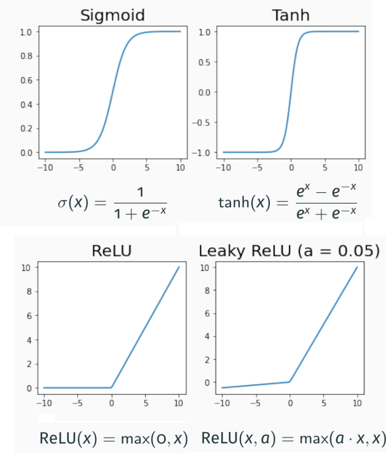
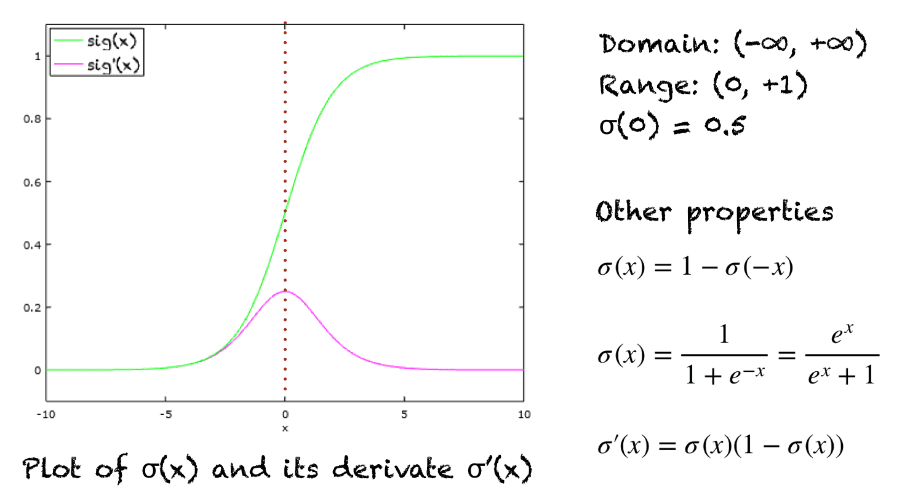
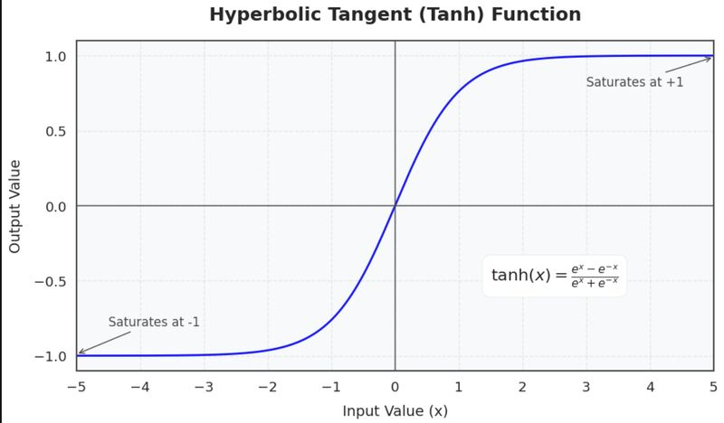
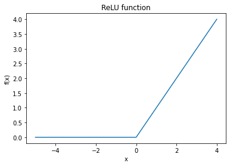
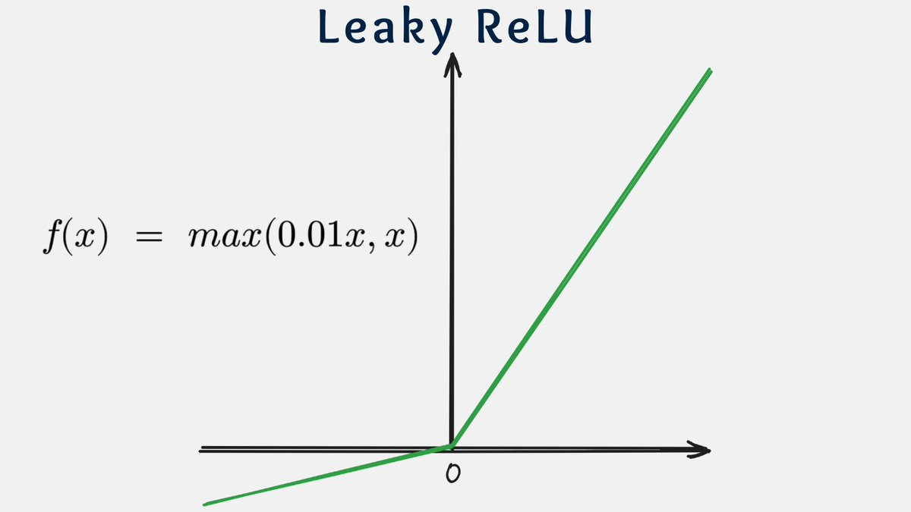
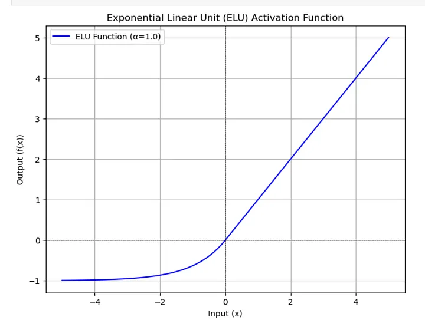

# Activation Function

---

# 🔵 What is an Activation Function?

An activation function decides **how much signal a neuron passes forward**.

Without it, a neural network becomes **only a linear model**.

---

# 🔵 Sigmoid (Logistic)

### Formula

$$\sigma(x) = \frac{1}{1 + e^{-x}}$$

### Output range

$(0, 1)$

### Derivative

$$\sigma'(x) = \sigma(x),(1 - \sigma(x))$$

### Situation (When to use)

- Binary classification output layer
- Probability estimation

### Problems

- Vanishing gradient
- Slow training
- Not zero-centered

---

# 🔵 2. Tanh

### Formula

$\tanh(x) = \frac{e^x - e^{-x}}{e^x + e^{-x}}$

### Output range

$(-1, 1)$

### Derivative

$\frac{d}{dx}\tanh(x) = 1 - \tanh^2(x)$

### Situation

- RNN hidden states
- When zero-centered output is helpful

### Problems

- Still suffers from vanishing gradient

---

# 🔵 3. ReLU (Rectified Linear Unit)

### Formula

$\text{ReLU}(x) = \max(0, x)$

### Derivative

$\text{ReLU}'(x) =
\begin{cases}
1 & x > 0 \\
0 & x \le 0
\end{cases}$

### Situation

- Default choice for hidden layers
- CNNs and deep networks

### Advantages

- Fast training
- No vanishing gradient for positive values

### Problem

- **Dying ReLU** (neurons stuck at 0)

---

# 🔵 4. Leaky ReLU

### Formula

$\text{LeakyReLU}(x) =\begin{cases}x & x > 0 \\ \alpha x & x \le 0\end{cases}$

(α is small, e.g. 0.01)

### Derivative

$\text{LeakyReLU}'(x) = \begin{cases}1 & x > 0 \\ \alpha & x \le 0\end{cases}$

### Situation

- When dying ReLU is a problem
- Often used in GAN discriminators and deep CNNs where pure ReLU caused dead neurons.

---

# 🔵 5. Parametric ReLU (PReLU)

### Formula

$\text{PReLU}(x) =\begin{cases}x & x > 0 \\a x & x \le 0\end{cases}$

where $a$ is a learnable parameter.

**Derivative**

$f'(x) =\begin{cases}1 & x \ge 0 \\a & x < 0\end{cases}$

### Difference from Leaky ReLU

- (a) is **learned**, not fixed

### Situation

- Deep CNNs
- When model needs flexibility
- Used in some deep vision architectures to improve accuracy.
- Like Leaky ReLU but with trainable negative slope, allowing the network to learn optimal leakage.

---

# 🔵 6. ELU (Exponential Linear Unit)

### Formula

$\text{ELU}(x) = \begin{cases}x & x > 0 \\\alpha(e^x - 1) & x \le 0\end{cases}$

**Derivative**

$f'(x) =\begin{cases}1 & x \ge 0 \\f(x) + \alpha & x < 0\end{cases}$

### Situation

- Faster convergence
- More stable gradients
- Aims to combine benefits of ReLU with smoother negative region and mean activations closer to zero.
- Sometimes preferred when smoothness around 0 matters.

### Problem

- Slightly slower computation

---

# 🔵 7. Softmax

**Formula** 

$\text{Softmax}(x_i) =\cfrac{e^{x_i}}{\sum_j e^{x_j}} \ \ \ \ \ \ \ \text{ where } \mathbf{x} = [x_1, \dots, x_j] \text{ is the input vector}$

**Derivative** (Jacobian)

$\frac{\partial f(x_i)}{\partial x_j} = \frac{\partial y_i}{\partial z_i}=\begin{cases} f(x_i)(1 - f(x_i)) & \text{if } i = j \\ -f(x_i)f(x_j) & \text{if } i \neq j \end{cases}$

### Output range

$(0, 1), \quad \text{sum = 1}$

### Situation

- Multi-class classification output layer
- Combined with cross‑entropy loss.

### Combined with

- Cross-entropy loss

---

# 🔵 Softplus

**Formula**

$f(x) = \ln(1 + e^{x})$

**Derivative**

$f'(x) = \sigma(x)$

**Use cases**

- Smooth approximation to ReLU.
- Used when a differentiable, always‑positive output is needed (e.g., to parameterize variance in probabilistic models).

---

# 🔵 8. Swish

### Formula

$\text{Swish}(x) = x \cdot \sigma(x)$

### Situation

- Deep networks
- Used in EfficientNet

### Advantage

- Smooth
- Better gradient flow than ReLU

**Derivative**

$f'(x) = \sigma(x) + x \cdot \sigma(x) \cdot (1 - \sigma(x))$

**Use cases**

- Smooth, non‑monotonic activation; sometimes outperforms ReLU on deep nets.
- Used in some modern CNN architectures and can be seen as a learned‑scale ReLU variant.

---

---

# 🔵 9. GELU (Gaussian Error Linear Unit)

**Formula** (exact)

$f(x) = x \,\Phi(x)$

where $\Phi(x)$ is the CDF of the standard normal distribution.

### Formula (approx)

$\text{GELU}(x) \approx x \cdot \sigma(1.702x)$

Common approximate formula used in practice:

$f(x)≈0.5x(1+tanh⁡(2π(x+0.044715x3)))f(x) \approx 0.5 x \left(1 + \tanh\left(\sqrt{\frac{2}{\pi}} \left(x + 0.044715 x^3\right)\right)\right)$

$f(x)≈0.5x(1+tanh(π2 (x+0.044715x3)))$

**Derivative**

- No simple closed form; typically handled automatically by autodiff.
- Conceptually, $f'(x)$ involves $\Phi(x)$ and the standard normal PDF.

**Use cases**

- Default activation in many Transformer models (e.g., BERT, GPT‑style blocks).
- Works well with large‑scale language and vision transformers.

### Situation

- Transformers (BERT, GPT)

### Why used

- Smooth
- Probabilistic interpretation

---

# 🔵 10. Linear (Identity)

### Formula

f(x) = x

### Situation

- Regression output layer

---

# 🔵 Summary Table

| Activation | Range | Used In |
| --- | --- | --- |
| Sigmoid | (0,1) | Binary output |
| Tanh | (-1,1) | RNNs |
| ReLU | [0,∞) | Default hidden |
| Leaky ReLU | (-∞,∞) | Avoid dying ReLU |
| ELU | (-α,∞) | Stable training |
| Softmax | Probabilities | Multi-class |
| GELU | Smooth | Transformers |
| Linear | (-∞,∞) | Regression |

---

# 🧠 Exam Rule (Very Important)

> Hidden layers → ReLU / GELU
Binary output → Sigmoid
Multi-class output → Softmax
Regression output → Linear
>